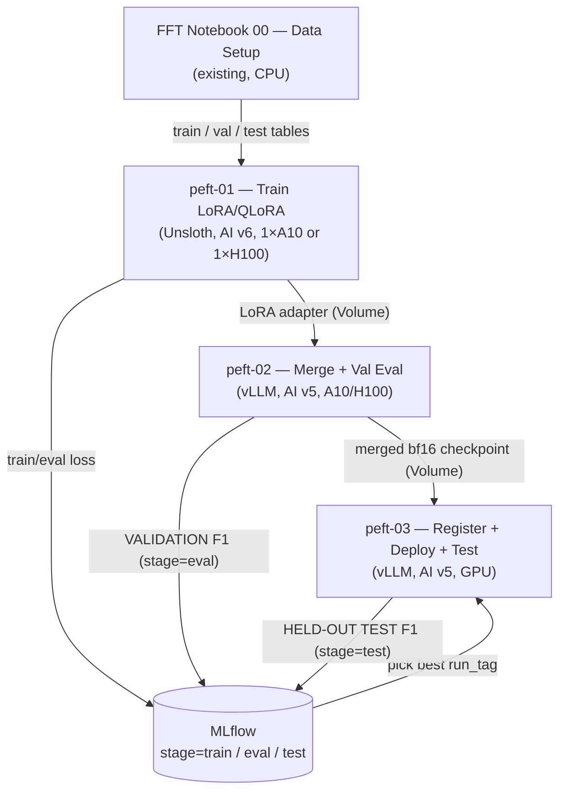

# Agency PEFT Fine-Tuning Pipeline — Llama 3.1 8B + Unsloth + vLLM

Parameter-efficient (LoRA / QLoRA) fine-tuning of **Llama 3.1 8B Instruct** with **Unsloth** on Databricks AI Runtime, adapter merge into bf16 weights, local vLLM validation eval, and Model Serving deployment (vLLM Custom LLM Serving).

It uses the **same dataset, splits, prompt, and metrics** as the [FFT workflow](../../LLM_FFT_finetuning_workflow/notebooks/README.md), so PEFT and FFT F1 numbers are directly comparable.

---

## Architecture Overview



> **Select on validation, report on test.** Compare `stage=eval` runs (notebook 02) to pick a `run_tag`; score the held-out test set **once** on it in notebook 03 (`stage=test`).

**Why three notebooks / two environments:** Unsloth (training) and vLLM (inference) pin conflicting torch/transformers versions. Notebook 01 runs AI v6 + Unsloth; notebooks 02/03 run AI v5 + the pinned vLLM stack. Only the small LoRA adapter crosses between them — the merge happens in the vLLM environment with plain `peft`.

---

## Compute & Volume Layout

| Resource | Purpose |
| --- | --- |
| Tables `agency_ft_dataset_{train,val,test}_v3` | Inputs, created by FFT notebook 00 (the instruction prompt is already inside the `prompt` column) |
| Volume `training_data` | `agency_prompt.txt`, per-run HF datasets `agency_peft_{train,eval}_{run_tag}` |
| Volume `checkpoints` | `agency-peft-adapter-{run_tag}` (~170 MB), `agency-peft-merged-{run_tag}` (~16 GB), trainer output |
| UC model | `fins_genai.fine_tuning.llama31_8b_agency_peft` (versions tagged `run_tag`) |
| Endpoint | `agency-llama-peft-vllm` |

---

## The `train_mode` flag (notebook 01)

| `train_mode` | Base model | `gpu_type` | `max_seq_length` | batch × accum | Use when |
| --- | --- | --- | --- | --- | --- |
| `qlora_4bit` (**default**) | `unsloth/Meta-Llama-3.1-8B-Instruct-bnb-4bit` | A10 | 4096 | 2 × 4 | Start here: cheaper, more available, fast iteration |
| `lora_bf16` | `unsloth/Meta-Llama-3.1-8B-Instruct` | H100 | 16384 | 1 × 8 | More precision; long documents without dropping |

Leave `base_model`, `gpu_type`, `max_seq_length`, `per_device_batch_size`, `gradient_accumulation_steps` **blank** to inherit the mode default; any value you type overrides it. Shared defaults: `lora_r=16`, `lora_alpha=16`, all 7 linear modules, `lr=2e-4`, `epochs=3`, `adamw_8bit`.

`run_tag = {train_mode}_r{lora_r}_lr{learning_rate}_ep{num_epochs}` (e.g. `qlora_4bit_r16_lr2e-4_ep3`) names every artifact and is the input to notebooks 02 and 03.

---

## Notebooks

### peft-01 — Train (`peft-01_train-lora-unsloth`)

- Renders each row as a Llama 3.1 chat (`user: prompt`, `assistant: JSON`) and **drops examples longer than `max_seq_length`** (truncation would cut the JSON answer). Dropped counts are printed and logged (`dropped_overlength_train/eval`). At 4096 on A10 expect a noticeable share of long documents to be skipped for training — evaluation still scores every document.
- **Response-only loss** via Unsloth `train_on_responses_only` — asserted twice (driver preview + inside the trainer): one BOS, supervised span starts with `{`, ends with `<|eot_id|>`, and `pad_token != eos_token` so the model learns to stop.
- `@distributed(gpus=1, gpu_type=GPU_TYPE)` launches training; `eval_strategy="epoch"` + `load_best_model_at_end` keeps the best epoch (by `eval_loss`) in a single run.
- Saves **only the adapter** to `agency-peft-adapter-{run_tag}`; logs library versions (`peft_version`, …) to MLflow (`stage=train`).

### peft-02 — Merge + validation eval (`peft-02_merge-and-val-eval`)

- Loads the **bf16** Instruct base (also for `qlora_4bit` adapters), applies the adapter, `merge_and_unload()`, saves `agency-peft-merged-{run_tag}`. Skips the merge if it already exists.
- Checks the merge base matches the training base, and compares merged vs. unmerged greedy output (small drift is expected and only warned).
- Local vLLM on the **val** split → field-level metrics → MLflow `stage=eval`, plus `json_parse_failures` and `inference_errors`.
- On A10 keep `max_num_seqs=2`; raise it on H100 for throughput.

### peft-03 — Register, deploy, test (`peft-03_register-deploy-test`)

- Local vLLM smoke test (the real pre-deploy check — `predict` is a stub for custom-entrypoint models).
- MLflow `ChatModel` + vLLM `metadata.entrypoint` + `env_pack="databricks_model_serving"` → UC (20–30 min to READY). Set `model_version` to redeploy an existing version without re-registering.
- Creates/updates the endpoint (`workload_type` `GPU_LARGE` default, `GPU_MEDIUM` = A10), then `ai_query` over the **test** split → MLflow `stage=test`.

---

## Metrics (identical to FFT)

`all_precision / all_recall / all_f1` over every schema field and `top8_*` over the 9 priority fields; fuzzy match `SequenceMatcher` ratio > 0.6 (lowercased); left join on ground truth so a failed document counts as FN; a wrong value counts as FP (FFT convention). Extra diagnostics: `json_parse_failures` (outputs that are not a JSON object) and `inference_errors` (notebook 02).

> FFT notebook 02 currently uses an **inner** join (failed docs dropped), while FFT notebook 05 and these PEFT notebooks use a **left** join. If FFT val runs had inference errors, their val F1 is slightly optimistic relative to PEFT val F1. Test F1 (notebook 05 vs. peft-03) is directly comparable.

---

## Running the pipeline

1. **Once:** make sure FFT notebook 00 has built the tables and `agency_prompt.txt` is in the `training_data` Volume.
2. **peft-01** on Serverless GPU, **AI v6** (default `qlora_4bit` / A10). Copy the printed `run_tag`.
3. **peft-02** on Serverless GPU, **AI v5**, with that `run_tag`. Repeat 2–3 for other configs (e.g. `learning_rate` 1e-4 / 5e-4, `train_mode=lora_bf16`).
4. Compare `stage=eval` runs in the MLflow experiment; pick the best `run_tag`.
5. **peft-03** on Serverless GPU, **AI v5**, with the winning `run_tag` → endpoint + held-out test F1.

### LoRA vs. FFT hyperparameters

- LoRA's best learning rate is typically **~10× FFT's** (2e-4 vs. ~1e-5) and fairly stable across ranks, so the default is usually close — but it is still the most sensitive knob.
- The effective update scales with `alpha / r`: when changing `lora_r`, keep `alpha / r` fixed (or you are also changing the effective LR).
- Epochs are chosen within a run (best `eval_loss` epoch is kept), so no epoch grid is needed.
- If PEFT F1 is clearly below FFT: try a small LR check (1e-4 / 2e-4 / 5e-4), then a larger `lora_r`, then `lora_bf16` for full-length context. Add an FFT-style job/sweep only if that manual loop becomes tedious.

### Optional: pre-stage base models on a Volume

If the workspace blocks `huggingface.co` egress, or to avoid re-downloading each run, snapshot the models once (any notebook with internet access):

```python
from huggingface_hub import snapshot_download

for repo in ["unsloth/Meta-Llama-3.1-8B-Instruct", "unsloth/Meta-Llama-3.1-8B-Instruct-bnb-4bit"]:
    snapshot_download(repo, local_dir=f"/Volumes/fins_genai/fine_tuning/checkpoints/base_models/{repo.split('/')[1]}")
```

Then set `base_model` (peft-01) and `merge_base_model` (peft-02) to those `/Volumes/...` paths. With Volume paths, notebook 02 cannot auto-verify the merge base matches the training base — make sure they are the same model.

---

## Troubleshooting

| Symptom | Cause | Fix |
| --- | --- | --- |
| CUDA/ABI import errors after installs | Unsloth and vLLM installed in one env | Keep 01 (Unsloth, AI v6) and 02/03 (vLLM, AI v5) separate; never `%pip install vllm` in 01 |
| `transformers was changed to 5.x` assert in 02/03 | A package pulled a newer transformers | Install `peft` with `--no-deps`; don't upgrade AI v5 pins (segfault risk) |
| `peft` fails to load `adapter_config.json` in 02 | peft version in 02 older than in 01 | Set the 02 `peft==` pin to notebook 01's logged `peft_version` |
| vLLM aborts at startup with an OpenSSL/FIPS error | `opencv-python-headless>=4.13` | Keep the second-pass pin `opencv-python-headless==4.12.0.88` |
| Unsloth compile error on the training worker | torch.compile inside `@distributed` | Add `os.environ["UNSLOTH_COMPILE_DISABLE"] = "1"` at the top of `run_training` |
| Training waits for a GPU for a long time | H100 capacity | Use the A10 default (`qlora_4bit`), or retry later |
| OOM on A10 during training | `max_seq_length` too high for 24 GB | Keep 4096, or `per_device_batch_size=1` for 6–8K |
| vLLM KV-cache / memory error on A10 in 02/03 | 20K context on 24 GB | `max_num_seqs=2`; lower `max_model_len` to 16384 |
| Many `inference_errors` (timeouts) in 02 | Long docs on A10 | Raise `request_timeout`; or run 02 on H100 |
| High `json_parse_failures` | Output truncated at `max_new_tokens`, or model not stopping | Check the masking asserts passed; check `dropped_overlength_train` (A10) — consider `lora_bf16` |
| Masking assert fails before training | Template / BOS / tokenizer mismatch | Do not train; inspect the printed masked/supervised spans |
| Model download fails (401/403 or network) | Gated repo or blocked egress | Use the `unsloth/*` mirrors (no token), or pre-stage on a Volume (above); tokens only via `dbutils.secrets` |
| `TimeoutError` waiting for READY | `env_pack` failed silently | Re-run the registration cell (new version) |
| OOM (exit 137) during registration | `env_pack` on CPU compute | Run notebook 03 on Serverless GPU |
| Endpoint disappeared overnight | GPU endpoints without scale-to-zero are cleaned up | Re-run notebook 03 with `model_version` set (no re-registration) |

---

## Resources

* [Fine-tune Llama with Unsloth (Serverless GPU)](https://docs.databricks.com/aws/en/machine-learning/ai-runtime/examples/tutorials/sgc-finetune-llama-unsloth)
* [Distributed Unsloth fine-tuning](https://docs.databricks.com/aws/en/machine-learning/ai-runtime/examples/tutorials/sgc-finetune-llama-unsloth-distributed)
* [Serve custom LLMs (vLLM)](https://docs.databricks.com/aws/en/machine-learning/model-serving/serve-custom-llms)
* [Unsloth docs](https://docs.unsloth.ai/) · [PEFT](https://huggingface.co/docs/peft) · [vLLM](https://docs.vllm.ai/)
