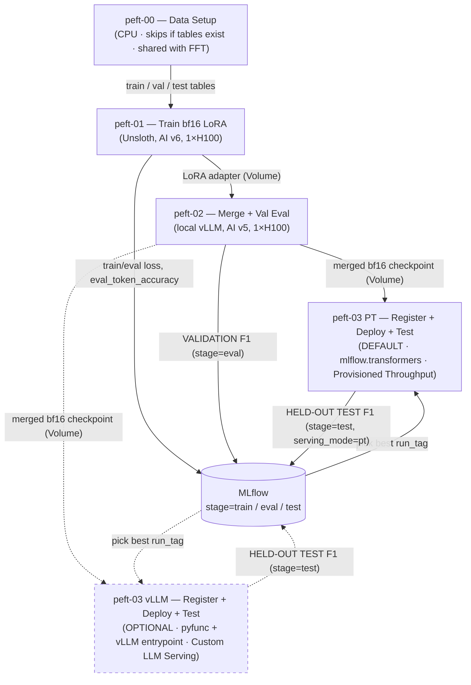

# Agency PEFT Fine-Tuning Pipeline — Llama 3.1 8B + Unsloth + Provisioned Throughput

Parameter-efficient (bf16 LoRA, 1×H100) fine-tuning of **Llama 3.1 8B Instruct** with **Unsloth** on Databricks AI Runtime, adapter merge into bf16 weights, local vLLM validation eval, and deployment on a **Provisioned Throughput** Model Serving endpoint (default). Serving with vLLM Custom LLM Serving is kept as an optional alternative.

It uses the **same dataset, splits, prompt, and metrics** as the [FFT workflow](../../LLM_FFT_finetuning_workflow/notebooks/README.md), so PEFT and FFT F1 numbers are directly comparable. `peft-00` is a copy of FFT notebook 00 so this folder is self-contained; both write the **same shared tables**, and `peft-00` leaves existing splits untouched unless you force a rebuild.

---

## Architecture Overview



Solid lines are the default path; dashed lines are the optional vLLM path.

> **Select on validation, report on test.** Compare `stage=eval` runs (notebook 02) to pick a `run_tag`; score the held-out test set **once** on it in notebook 03 (`stage=test`).

**Why Provisioned Throughput is the default:** Llama 3.1 is an architecture Provisioned Throughput supports, so a fine-tuned and merged Llama 3.1 8B can be served by the Databricks-managed, optimized inference engine. Compared with self-managed vLLM, it needs no `env_pack` (registration is much faster), supports autoscaling between `min/max_provisioned_throughput`, and removes the vLLM version pinning from the serving path. The vLLM notebook remains for architectures Provisioned Throughput doesn't support, or when you need vLLM-specific control (flags, context length, custom entrypoint).

**Why separate notebooks / environments:** Unsloth (training) and vLLM (inference) pin conflicting torch/transformers versions. Notebook 01 runs AI v6 + Unsloth. Notebook 02 and the optional vLLM notebook run AI v5 + the pinned vLLM stack. The PT notebook runs AI v5 with `transformers==4.57.6` + `peft` and no vLLM. Only the small LoRA adapter crosses from notebook 01; merging happens with plain `peft`.

---

## Compute & Volume Layout

| Resource | Purpose |
| --- | --- |
| Tables `agency_ft_dataset_{train,val,test}_v3` | Inputs, created once by `peft-00` or FFT notebook 00 (identical logic, same tables; the instruction prompt is already inside the `prompt` column) |
| Volume `training_data` | `agency_prompt.txt`, per-run HF datasets `agency_peft_{train,eval}_{run_tag}` (Arrow, via `save_to_disk`) |
| Volume `checkpoints` | `agency-peft-adapter-{run_tag}` (~170 MB), `agency-peft-merged-{run_tag}` (~16 GB, with `.merged_from_adapter` marker), trainer output |
| UC model (default, PT) | `fins_genai.fine_tuning.llama31_8b_agency_peft_pt` (versions tagged `run_tag`) |
| UC model (optional, vLLM) | `fins_genai.fine_tuning.llama31_8b_agency_peft` (versions tagged `run_tag`) |
| Endpoint (default, PT) | `agency-llama-peft-pt` — Provisioned Throughput |
| Endpoint (optional, vLLM) | `agency-llama-peft-vllm` — Custom LLM Serving, `GPU_LARGE` |

The two serving paths use **separate UC model names and endpoints**, so both can exist side by side for comparison.

---

## Training configuration (notebook 01 widgets)

| Widget | Default | Notes |
| --- | --- | --- |
| `base_model` | `unsloth/Meta-Llama-3.1-8B-Instruct` | bf16 weights; HF id or a `/Volumes/...` path |
| `gpu_type` | `H100` | passed to `@distributed(gpus=1, gpu_type=...)` |
| `max_seq_length` | `16384` | covers ~all documents (largest ≈ 13K input + 3.5K output) |
| `per_device_batch_size` × `gradient_accumulation_steps` | `1` × `8` | effective batch 8 |
| `lora_r` / `lora_alpha` | `16` / `16` | all 7 linear modules, dropout 0 |
| `learning_rate` / `num_epochs` | `2e-4` / `3` | `adamw_8bit`, linear schedule, 5% warmup |

bf16 LoRA on one H100 only. A 4-bit QLoRA / A10 path was considered and dropped: roughly 2.5× slower wall-clock, and at the A10's 4096-token limit about half the documents would be dropped from training.

`run_tag = lora_r{lora_r}_lr{learning_rate}_ep{num_epochs}` (e.g. `lora_r16_lr2e-4_ep3`) names every artifact and is the input to notebooks 02 and 03.

---

## Notebooks

### peft-00 — Data setup (`peft-00-setup-datasets`)

- Same logic as FFT notebook 00: reads `sample_input_output.xlsx` from the `training_data` Volume, strips the `[INST]` markers, drops empty/invalid rows, builds `prompt = agency_prompt.txt + OCR`, splits 85/5/10 (`randomSplit(seed=42)`), and writes `agency_master_dataset_v3` and `agency_ft_dataset_{train,val,test}_v3`.
- **Guard:** if all three split tables already exist, the notebook exits without touching them (`dbutils.notebook.exit`). It stops with an error if only some exist (an incomplete earlier run). Set the `force_rebuild` widget to `true` to drop and rebuild them.
- **Why the guard:** the FFT workflow reads the same tables, and `randomSplit` is not guaranteed to reproduce the same split on different compute. A rebuild can move documents between train/val/test, which makes results measured before the rebuild incomparable with results measured after it — for FFT as well as PEFT.
- Compute: serverless CPU. Run once, or when the source Excel / prompt changes (then with `force_rebuild=true`, and re-run both workflows' evals).

### peft-01 — Train (`peft-01_train-lora-unsloth`)

- Reads the train/val Delta tables on the notebook, renders each row as a Llama 3.1 chat (`user: prompt`, `assistant: JSON`), and **drops examples longer than `max_seq_length`** (truncation would cut the JSON answer). Dropped counts are printed and logged (`dropped_overlength_train/eval`); at 16384 almost nothing should be dropped. Evaluation always scores every document.
- Saves the prepared rows to the `training_data` Volume as HF datasets; the remote GPU worker started by `@distributed(gpus=1, gpu_type=GPU_TYPE)` loads them with `load_from_disk` (it has no Spark session and can't see the notebook's `/tmp`).
- **Response-only loss** via Unsloth `train_on_responses_only`. Because the rendered text already contains `<|begin_of_text|>`, the tokenizer's `add_bos_token` is turned off before training. Masking is asserted twice (driver preview + inside the trainer on real `input_ids`/`labels`): one BOS, supervised span starts with `{`, ends with `<|eot_id|>`, and `pad_token != eos_token` so the model learns to stop.
- `eval_strategy="epoch"` + `load_best_model_at_end` keeps the best epoch (by `eval_loss`) in a single run. Each epoch also logs **`eval_token_accuracy`**: argmax-token accuracy over the supervised JSON tokens only (logits are reduced to argmax IDs before accumulation to avoid host-RAM OOM on long sequences).
- MLflow: `.distributed()` creates the run automatically (see [Distributed training in notebooks](https://docs.databricks.com/aws/en/machine-learning/ai-runtime/distributed-training)); the function logs params, library versions (`peft_version`, …) and tags `stage=train` directly into it — no `mlflow.start_run()` inside the function. MLflow metrics: `loss` (training), `eval_loss` (validation), `eval_token_accuracy`, `train_loss` (run average).
- Saves **only the adapter** to `agency-peft-adapter-{run_tag}`.

#### Why chat format (vs. instruction format)

There are two common ways to format SFT data:

- **Instruction format** (Alpaca-style, used in the Unsloth starter notebook): one plain-text string such as `### Instruction: … ### Response: …`, trained and served as a text completion.
- **Chat format** (used here): a list of `messages` with roles (`user`, `assistant`, optionally `system`), rendered into tokens by the model's own chat template.

For a single-turn extraction task, **both work**: the model can learn the mapping either way. Chat format is the more general choice, because it covers instruction following (one user turn, one assistant turn) as well as multi-turn conversations. It is the better fit here for these reasons:

1. **It matches how the base model was trained.** Llama 3.1 *Instruct* was post-trained on its chat template (`<|start_header_id|>…<|end_header_id|>`, `<|eot_id|>`). Fine-tuning in that format builds on its existing instruction following. A new Alpaca template would make the model learn a prompt format it has never seen, which costs data and steps.
2. **Training and serving use the same tokens.** Every serving path here is a chat API: vLLM `/invocations`, the Provisioned Throughput `llm/v1/chat` task, and `ai_query` against a chat endpoint. The server applies the same chat template (saved with the merged tokenizer) to the incoming `messages`, so inference sees exactly the token layout used in training. Instruction format would need a completions-style endpoint, and every client would have to rebuild the prompt string by hand.
3. **Stopping is built in.** The template ends the assistant turn with `<|eot_id|>`, which is the model's end-of-sequence and stop token. With instruction format you must append EOS yourself; the Unsloth starter warns that forgetting it produces endless generation.
4. **The loss mask has a clean boundary.** The assistant header marks exactly where the answer starts, which is what `train_on_responses_only` uses to put the loss only on the JSON.
5. **It extends without reformatting data.** A system prompt, few-shot examples as turns, follow-up correction turns, or tool calls all fit the same structure.
6. **It keeps FFT and PEFT comparable.** The FFT workflow also trains on `messages` with its model's chat template.

Nuances and costs:

- **The template has to match exactly.** Chat format moves formatting into the tokenizer's template, which is less visible than a hand-written prompt string. If serving used a different template (a different tokenizer, a hand-edited `chat_template`, or a server-side override), outputs would degrade silently. Notebooks 02/03 therefore load the tokenizer from the merge base, compare its chat template with the adapter's, and save it with the merged model.
- **Hidden template content.** The Llama 3.1 template adds a system block ("Cutting Knowledge Date … Today Date …", ~25 tokens) even without a system message. It is harmless because serving adds the same block, but it counts toward `max_seq_length`.
- **Pre-rendered text needs BOS care.** The data is rendered with `apply_chat_template(tokenize=False)`, so the text already begins with `<|begin_of_text|>`. That is why notebook 01 sets `add_bos_token=False` and asserts exactly one BOS.
- **Base (non-instruct) models are different.** A base model has no trained chat template, and its special tokens have untrained embeddings. For base models, plain instruction/completion format is often simpler, or you have to train the chat template in explicitly.
- **Where the instruction lives.** Here the long extraction instruction sits inside the user turn (no system message), to match FFT and the `ai_query` calls. Moving it to a system message is equally valid, but training and serving must do the same thing. Prefix caching works either way, because the instruction is a shared prefix.
- **Capability is the same for this task.** Chat format doesn't make single-turn extraction more accurate by itself. The gains are compatibility (serving APIs, stop token, masking) and flexibility later.

### peft-02 — Merge + validation eval (`peft-02_merge-and-val-eval`)

- Loads the **bf16** Instruct base, applies the adapter, `merge_and_unload()`, saves `agency-peft-merged-{run_tag}` plus a `.merged_from_adapter` marker (adapter sha256, written last). Re-merges automatically if the adapter was retrained under the same `run_tag` or a previous copy was interrupted. The tokenizer is loaded from the merge base (not the adapter dir, which was written by notebook 01's newer transformers) and its chat template is compared with the adapter's.
- Checks the merge base matches the training base, and compares merged vs. unmerged greedy output (small drift is expected and only warned).
- Local vLLM on the **val** split → field-level metrics → MLflow `stage=eval`, plus `json_parse_failures` and `inference_errors`. A leftover vLLM server is killed and the port checked before launch.
- Runs on 1×H100 (`max_num_seqs=14` default). Needed on both serving paths: it is where the `run_tag` is selected.

### peft-03 PT — Register, deploy, test (**default**: `peft-03_register-deploy-pt`)

- **Merge (or reuse):** reuses `agency-peft-merged-{run_tag}` when its marker matches the current adapter; otherwise merges the adapter itself and writes the checkpoint + marker (same logic as notebook 02).
- **Register:** `mlflow.transformers.log_model(task="llm/v1/chat")` with the merged model + tokenizer → UC `llama31_8b_agency_peft_pt`, version tagged `run_tag`. **No `env_pack`** — Provisioned Throughput manages its own serving environment. Set `model_version` to redeploy an existing version without re-registering.
- **Eligibility check:** waits for the version to be READY, then calls `get-model-optimization-info` and asserts `optimizable`; the returned `throughput_chunk_size` (tokens/s) sizes the endpoint.
- **Deploy:** creates/updates `agency-llama-peft-pt` with `min_provisioned_throughput = max_provisioned_throughput = 1 chunk`. Raise `max_provisioned_throughput` (in chunk multiples) for more capacity / autoscaling.
- **Test:** smoke query (asserts JSON), then `ai_query` (`failOnError => false`) over the **test** split. Failed rows count in `inference_errors` and are scored as FN. Metrics are logged to MLflow run `test_pt_{run_tag}` with `stage=test`, `serving_mode=pt`.
- Compute: 1×H100, AI v5, no vLLM (the merge and `log_model` need the GPU node's memory).

### peft-03 vLLM — Register, deploy, test (**optional**: `peft-03_register-deploy-test-vllm`)

- Local vLLM smoke test (the real pre-deploy check — `predict` is a stub for custom-entrypoint models). Refuses a merged checkpoint whose marker doesn't match the current adapter.
- MLflow `ChatModel` + vLLM `metadata.entrypoint` + `env_pack="databricks_model_serving"` → UC `llama31_8b_agency_peft` (20–30 min to READY). Set `model_version` to redeploy without re-registering.
- Creates/updates `agency-llama-peft-vllm` on `GPU_LARGE` (same as FFT notebook 05, fixed replicas, no autoscaling), then `ai_query` (`failOnError => false`) over the **test** split → MLflow `test_{run_tag}`, `stage=test`.
- Use it when you need vLLM-specific control, or for architectures Provisioned Throughput does not support.

---

## Metrics (identical to FFT)

`all_precision / all_recall / all_f1` over every schema field and `top8_*` over the 9 priority fields; fuzzy match `SequenceMatcher` ratio > 0.6 (lowercased); left join on ground truth so a failed document counts as FN; a wrong value counts as FP (FFT convention). Extra diagnostics: `json_parse_failures` (outputs that are not a JSON object) and `inference_errors` (notebook 02 and both notebook 03 variants). Training adds `eval_token_accuracy` (notebook 01), which is a token-level signal, not the field-level F1 used for selection.

---

## Running the pipeline

1. **Once:** upload `sample_input_output.xlsx` and `agency_prompt.txt` to the `training_data` Volume, then run **peft-00** (serverless CPU). If FFT notebook 00 already built the tables, peft-00 just confirms they exist and exits.
2. **peft-01** on Serverless GPU **1×H100**, **AI v6**. Copy the printed `run_tag`. For a cheap first check, run with `num_epochs=1`.
3. **peft-02** on Serverless GPU **1×H100**, **AI v5**, with that `run_tag`. Repeat 2–3 for other configs (e.g. `learning_rate` 1e-4 / 5e-4, `num_epochs=2`).
4. Compare `stage=eval` runs in the MLflow experiment; pick the best `run_tag`.
5. **Default — peft-03 PT** (`peft-03_register-deploy-pt`) on Serverless GPU **1×H100**, **AI v5**, with the winning `run_tag` → Provisioned Throughput endpoint + held-out test F1.
6. *Optional —* **peft-03 vLLM** (`peft-03_register-deploy-test-vllm`) with the same `run_tag` if you want to compare against vLLM serving. Test F1 lands next to the PT run (filter MLflow on `serving_mode`).

Delete endpoints you no longer need; a redeploy later only needs the `model_version` widget (no re-registration).

### LoRA vs. FFT hyperparameters

- LoRA's best learning rate is typically **~10× FFT's** (2e-4 vs. ~1e-5) and fairly stable across ranks, so the default is usually close — but it is still the most sensitive knob.
- The effective update scales with `alpha / r`: when changing `lora_r`, keep `alpha / r` fixed (or you are also changing the effective LR).
- Epochs are chosen within a run (best `eval_loss` epoch is kept), so no epoch grid is needed.
- If PEFT F1 is clearly below FFT: try a small LR check (1e-4 / 2e-4 / 5e-4), then a larger `lora_r` (keep `alpha / r` fixed). Add an FFT-style job/sweep only if that manual loop becomes tedious.

### Optional: pre-stage base models on a Volume

If the workspace blocks `huggingface.co` egress, or to avoid re-downloading each run, snapshot the model once (any notebook with internet access):

```python
from huggingface_hub import snapshot_download

repo = "unsloth/Meta-Llama-3.1-8B-Instruct"
snapshot_download(repo, local_dir=f"/Volumes/fins_genai/fine_tuning/checkpoints/base_models/{repo.split('/')[1]}")
```

Then set `base_model` (peft-01) and `merge_base_model` (peft-02, peft-03 PT) to that `/Volumes/...` path. With Volume paths, the notebooks cannot auto-verify the merge base matches the training base — make sure they are the same model.

---

## Troubleshooting

| Symptom | Cause | Fix |
| --- | --- | --- |
| peft-00 exits immediately with "already exist … kept as is" | Split tables exist (built earlier by peft-00 or FFT notebook 00) | Expected — nothing to do. Use `force_rebuild=true` only when the source data or prompt changed |
| peft-00: `Only some split tables exist` assert | An earlier run stopped partway | Set `force_rebuild=true` and re-run |
| CUDA/ABI import errors after installs | Unsloth and vLLM installed in one env | Keep 01 (Unsloth, AI v6) separate from 02 / 03 (AI v5); never `%pip install vllm` in 01 |
| `transformers was changed to 5.x` assert in 02/03 | A package pulled a newer transformers | Install `peft` with `--no-deps`; don't upgrade AI v5 pins (segfault risk) |
| `peft` fails to load `adapter_config.json` in 02/03 | peft version in 02/03 older than in 01 | Set the `peft==` pin to notebook 01's logged `peft_version` |
| vLLM aborts at startup with an OpenSSL/FIPS error (02, vLLM 03) | `opencv-python-headless>=4.13` | Keep the second-pass pin `opencv-python-headless==4.12.0.88` |
| Unsloth compile error on the training worker | torch.compile inside `@distributed` | Add `os.environ["UNSLOTH_COMPILE_DISABLE"] = "1"` at the top of `run_training` |
| Double-BOS / masking assert fails before training | Template / BOS / tokenizer mismatch | Do not train; inspect the printed masked/supervised spans (`add_bos_token=False` is set for the pre-rendered text) |
| MLflow error about an active run inside `run_training` | `mlflow.start_run()` / `set_experiment()` called in the function | `.distributed()` already created the run; log directly into it |
| Host-RAM OOM during per-epoch eval | Full-vocab logits accumulated for token accuracy | Keep `preprocess_logits_for_metrics` (argmax before accumulation) |
| Training waits for a GPU for a long time | H100 capacity | Retry later; there is no smaller-GPU fallback in this workflow |
| OOM during training | an unusually long document at `max_seq_length=16384` | Lower `max_seq_length` (e.g. 12288); over-length docs are dropped and counted |
| vLLM KV-cache / memory error in 02 / vLLM 03 | GPU memory left by the in-notebook merge, or context too large | Lower `gpu_memory_utilization` slightly, or `max_model_len` to 16384 |
| Many `inference_errors` (timeouts) in 02 | Very long docs / high concurrency | Raise `request_timeout`, or lower `max_num_seqs` |
| High `json_parse_failures` | Output truncated at `max_new_tokens`, or model not stopping | Check the masking asserts passed; check `max_new_tokens` covers the longest JSON answers |
| Model download fails (401/403 or network) | Gated repo or blocked egress | Use the `unsloth/*` mirrors (no token), or pre-stage on a Volume (above); tokens only via `dbutils.secrets` |
| Val F1 looks like an older model / vLLM "ready" instantly | A vLLM server from an earlier interrupted run still holds port 3080 | Notebooks `pkill` it before launch and assert the port is free; if the assert fires, run `pkill -f vllm.entrypoints.openai.api_server` in a `%sh` cell |
| `... was merged from an older adapter` assert (vLLM 03) | Adapter retrained after the last merge | Re-run notebook 02 for that `run_tag` (the PT notebook re-merges on its own) |
| PT: `NOT eligible for Provisioned Throughput` assert | Model not logged with the `transformers` flavor / `task="llm/v1/chat"`, or an unsupported architecture | Register via `mlflow.transformers.log_model(task="llm/v1/chat")` from the merged HF checkpoint; otherwise use the vLLM notebook |
| PT: `get-model-optimization-info` returns 401 | `w.config.token` is `None` on serverless GPU (managed identity) | Use the notebook context token, as the PT notebook does |
| PT: throughput too low / queueing under load | Endpoint sized at one chunk | Raise `max_provisioned_throughput` in multiples of `throughput_chunk_size` |
| vLLM 03: `TimeoutError` waiting for READY | `env_pack` failed silently | Re-run the registration cell (new version) |
| vLLM 03: OOM (exit 137) during registration | `env_pack` on CPU compute | Run on Serverless GPU |
| GPU endpoint disappeared overnight | GPU endpoints without scale-to-zero may be cleaned up by workspace policy | Re-run notebook 03 with `model_version` set (no re-registration) |

---

## Resources

**Databricks — AI Runtime (Serverless GPU)**

* [AI Runtime overview](https://docs.databricks.com/aws/en/machine-learning/ai-runtime/overview)
* [Distributed training in notebooks (`@distributed`, automatic MLflow runs)](https://docs.databricks.com/aws/en/machine-learning/ai-runtime/distributed-training)
* [Environment and dependencies](https://docs.databricks.com/aws/en/machine-learning/ai-runtime/environment)
* [Data loading](https://docs.databricks.com/aws/en/machine-learning/ai-runtime/dataloading)
* [Experiment tracking and observability](https://docs.databricks.com/aws/en/machine-learning/ai-runtime/tracking-observability)
* [LLM fine-tuning examples](https://docs.databricks.com/aws/en/machine-learning/ai-runtime/examples/gpu-llms)
* [Fine-tune Llama with Unsloth (single GPU)](https://docs.databricks.com/aws/en/machine-learning/ai-runtime/examples/tutorials/sgc-finetune-llama-unsloth)
* [Fine-tune Llama with Unsloth (distributed)](https://docs.databricks.com/aws/en/machine-learning/ai-runtime/examples/tutorials/sgc-finetune-llama-unsloth-distributed)

**Databricks — Serving and inference**

* [Foundation Model APIs (Provisioned Throughput for fine-tuned / custom-weight models)](https://docs.databricks.com/aws/en/machine-learning/foundation-model-apis/)
* [On-demand Provisioned Throughput (`get-model-optimization-info`, throughput chunks)](https://docs.databricks.com/aws/en/machine-learning/foundation-model-apis/deploy-prov-throughput-foundation-model-apis)
* [Supported model architectures / availability by region](https://docs.databricks.com/aws/en/unity-gateway/model-region-availability)
* [Serve custom LLMs with vLLM (Custom LLM Serving)](https://docs.databricks.com/aws/en/machine-learning/model-serving/serve-custom-llms)
* [`ai_query` function (`failOnError`, result/errorMessage struct)](https://docs.databricks.com/aws/en/sql/language-manual/functions/ai_query)

**MLflow**

* [MLflow Transformers flavor (`mlflow.transformers.log_model`)](https://mlflow.org/docs/latest/ml/deep-learning/transformers/)

**Hugging Face and libraries**

* [Datasets — save/load (`save_to_disk`, `load_from_disk`)](https://huggingface.co/docs/datasets/process#save)
* [TRL — `SFTTrainer` / `SFTConfig`](https://huggingface.co/docs/trl/sft_trainer)
* [PEFT — LoRA, merging adapters (`merge_and_unload`)](https://huggingface.co/docs/peft/developer_guides/lora#merge-lora-weights-into-the-base-model)
* [Transformers — chat templates (`apply_chat_template`)](https://huggingface.co/docs/transformers/chat_templating)
* [Transformers — `Trainer` (`compute_metrics`, `preprocess_logits_for_metrics`)](https://huggingface.co/docs/transformers/main_classes/trainer)
* [Unsloth docs (`FastLanguageModel`, `train_on_responses_only`)](https://docs.unsloth.ai/)
* [vLLM docs](https://docs.vllm.ai/)
