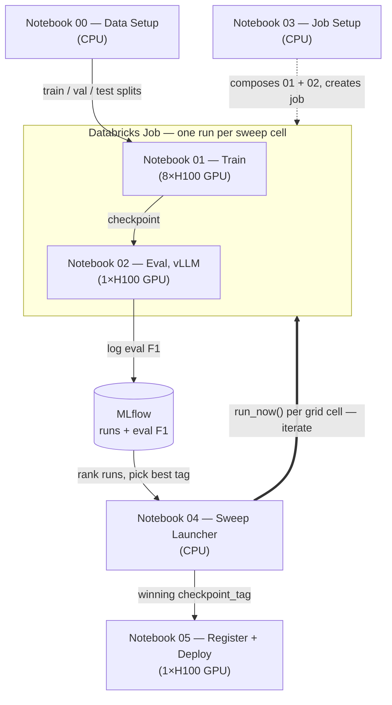
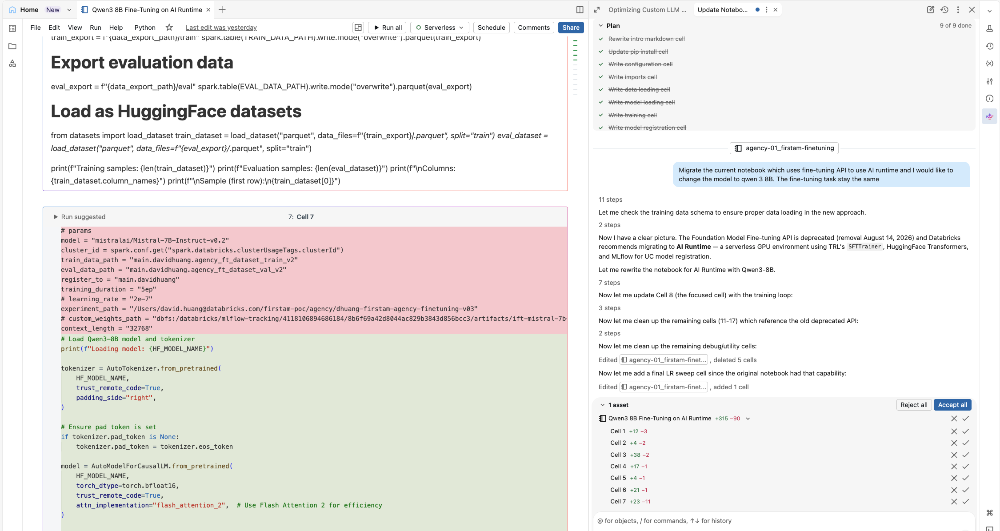
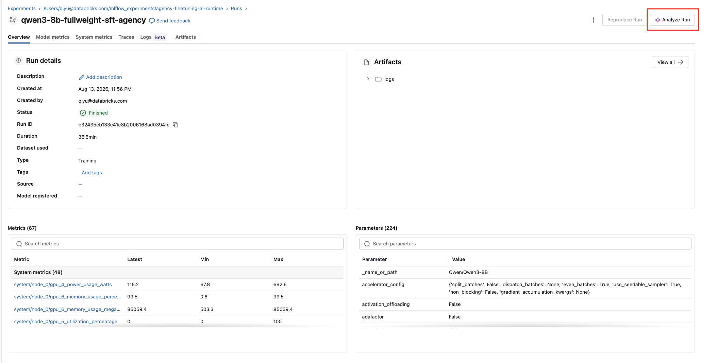
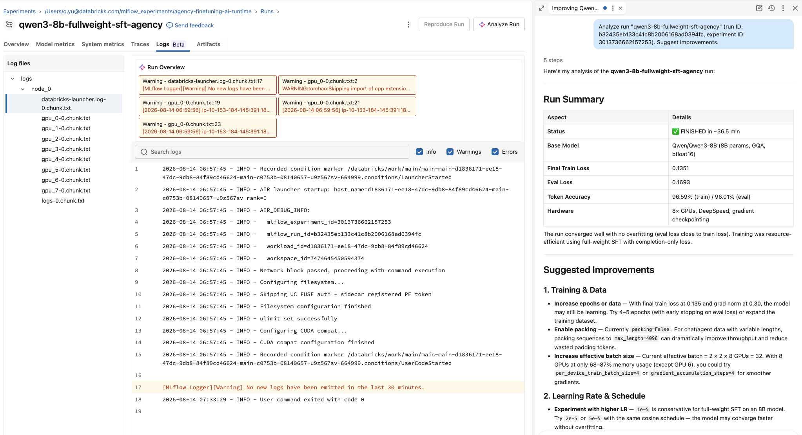

# Agency Fine-Tuning Pipeline — AI Runtime + vLLM

End-to-end workflow for **full-weight supervised fine-tuning (SFT)** of a large language model (Qwen3-8B) on Databricks AI Runtime, with local vLLM-based evaluation and Model Serving deployment.

This pipeline fine-tunes the model to extract structured entities from title insurance policy documents (text → JSON), achieving >92% field-level F1 on 78+ extraction fields.

---

## Architecture Overview



---

## Compute & Volume Layout

| Resource | Purpose |
| --- | --- |
| **Volume: `training_data`** | Read-only inputs: datasets, prompts, DeepSpeed config |
| **Volume: `checkpoints`** | Model outputs: training checkpoints, final weights |
| **Catalog/Schema** | `fins_genai.fine_tuning` — UC tables for train/val/test splits |

All notebooks expose `catalog`, `schema`, `volume`, and `volume_model` as **widgets/job parameters**, so the same code works in interactive mode and as a scheduled job and is easy to customize

---

## Notebook Descriptions

### Notebook 00 — Data Setup (`agency-00-setup-datasets`)

**Compute:** Serverless CPU

**Purpose:** Prepares the fine-tuning dataset from a paired Excel file (text + ground-truth extraction JSON). Builds train/val/test splits as UC Delta tables 

**Key steps:**
1. Loads data in `.xlsx` format from the UC Volume
2. Formats each example as a multi-turn chat (system + user + assistant) using Qwen3's chat template
3. Splits into train (85%) / val (5%) / test (10%)
4. Writes Delta tables: `agency_ft_dataset_train_v3`, `agency_ft_dataset_val_v3`, `agency_ft_dataset_test_v3`

**Run frequency:** Once (or when source data changes).

---

### Notebook 01 — Fine-Tuning (`agency-01_finetuning-ai-runtime`)

**Compute:** Serverless GPU — 8×H100 (via `@distributed` decorator)

**Purpose:** Full-weight SFT of Qwen3-8B using TRL's `SFTTrainer` with DeepSpeed ZeRO Stage 3.

**Key steps:**

1. Reads train/val data from delta table and serializes HuggingFace `Dataset` objects from them
2. Saves HuggingFace `Dataset` objects to the Volume for direct loading by the HuggingFace `dataset` api
3. Perform full-weight SFT using TRL framework
4. Save the fine-tuned model weights to the UC volume 

**Key concepts:**

* **`@distributed(gpus=8, gpu_type="H100")`** — the Serverless GPU Python API provisions 8 H100 GPUs on a single node and launches distributed training across all 8 processes.
* **DeepSpeed ZeRO-3** — shards model parameters, gradients, and optimizer states across GPUs, enabling full-weight training of 8B-parameter models without quantization.
* **Completion-only loss** (`SFTConfig(completion_only_loss=True)`) — masks the prompt/instruction tokens so the loss is computed only on the assistant's response (the extraction JSON). This is because Qwen-3-8B uses a chat complete template by default
* **MLflow integration** — `report_to="mlflow"` logs training/eval loss per epoch. The experiment path is parameterized so different sweeps can log to different experiments.

**Outputs:**
* Final model checkpoint saved to `/Volumes/.../checkpoints/agency-ft-final-{RUN_TAG}`
* MLflow experiment run with training metrics

**Important configuration:**
```
RUN_TAG = f"lr{learning_rate}_ep{num_epochs}"   # e.g., "lr1e-5_ep3"
```
This tag uniquely identifies each checkpoint across sweep runs.

#### Use Genie Code to migrate / generate AI runtime notebook from the Databricks FT API or from scratch

Genie code has build-in [data science & ML agent](https://docs.databricks.com/aws/en/notebooks/ds-agent) and AI runtime agent skills with capability of code generation, mlflow run analysis, and GPU debugging.

* Genie code can automate the code generation for migration ti AI runtime. (TRL framework is typically the default since it is most commonly used FT framework)

    

* Genie code can perform analysis on MLFlow runs and debug GPU logs

    

* Genie code provides detailed analysis and recommendations

    

---

### Notebook 02 — Local vLLM Evaluation (`agency-02_local-vllm-eval`)

**Compute:** Serverless GPU — 1×H100

**Purpose:** Evaluates a fine-tuned checkpoint without deploying a serving endpoint. Launches a **local vLLM server** inside the notebook, runs batch inference over the test set, and scores field-level precision/recall/F1.

**How local vLLM works:**

1. Copies checkpoint from UC Volume to local SSD (vLLM needs local disk access)
2. Patches the Qwen3 chat template to disable `<think>` tag generation
3. Starts `vllm.entrypoints.openai.api_server` as a background subprocess
4. Sends requests via HTTP to `localhost:3080` using a thread pool (4 concurrent workers)
5. Kills the server after inference completes

This notebook is developed based on this [Databricks official document example](https://docs.databricks.com/aws/en/machine-learning/model-serving/serve-custom-llms#example-notebook)

**Metrics logged to MLflow:**

* `all_f1`, `all_precision`, `all_recall` — across all 78+ extraction fields
* `top8_f1`, `top8_precision`, `top8_recall` — 9 high-priority business fields (PolicyNumber, OwnerPolicyNumber/Amount/Date, LoanPolicyNumber/Amount/Date, OwnerFile, LoanFile)
* Tagged with `stage: "eval"` for filtering in notebook 04

**Scoring approach:** Fuzzy matching (SequenceMatcher ratio > 0.6) handles minor OCR/formatting differences between ground truth and predictions.

---

### Notebook 03 — Job Setup (`agency-03-job-setup`)

**Compute:** Any (runs once to create the job)

**Purpose:** Creates a Databricks Job with two sequential tasks using the Databricks Python SDK:

| Task | Notebook | Compute | Purpose |
| --- | --- | --- | --- |
| `train` | notebook 01 | GPU 8×H100 | Fine-tune the model |
| `eval` | notebook 02 | GPU 1×H100 | Evaluate the checkpoint |

**Job parameters** (overridable at run time):
`catalog`, `schema`, `volume`, `volume_model`, `learning_rate`, `num_epochs`, `max_seq_length`, `per_device_batch_size`, `gradient_accumulation_steps`, `num_gpus`, `gpu_type`, `experiment_path`, `DTYPE`, `MAX_MODEL_LEN`, `MAX_NEW_TOKENS`

**Notes**

* The job is idempotent — running this notebook again updates the existing job in place.
* The job setup run one run at time and wait in queue. This is being conservation on using GPU resources. Users can adjust the `max_concurrent_runs` based on the availability of the GPU resources

    ```json
    "max_concurrent_runs": 1,    # Adjust based on GPU resource
    "queue": {"enabled": True},  # Enable queuing execution
    ```
* MLflow experiment_path (i.e. experiment object) is a job parameter. Each experiment contains all the runs of a hyper-pmarater sweep. This is design to allow user to version hyper-parameters sweep runs

---

### Notebook 04 — Sweep Launcher (`agency-04-sweep-launcher`)

**Compute:** Serverless CPU

**Purpose:** Orchestrates a hyperparameter sweep by submitting multiple job runs with different parameter combinations, then collects results and identifies the best checkpoint.

**Workflow:**

1. Defines a sweep grid (e.g., `learning_rate × num_epochs` combinations)
2. Submits each combination as a separate job run via `w.jobs.run_now()`
3. Polls until all runs complete
4. Queries MLflow for eval runs tagged `stage=eval`, ranks by `all_f1`
5. Prints the winning checkpoint tag (e.g., `lr2e-5_ep4`)

**Output:** The best `checkpoint_tag` — manually entered into notebook 05's widget for registration and deployment.

**Note:** The best model selection will compare all the eval runs within a MLflow experiment, i.e. one hyper-parameters sweep

---

### Notebook 05 — Register & Deploy (`agency-05_deploy-endpoint-test`)

**Compute:** Serverless GPU — 1×H100

**Purpose:** Registers the best model to Unity Catalog with `env_pack` and deploys it to a Model Serving endpoint.

**Key steps:**

1. Enter the winning `checkpoint_tag` from notebook 04 into the widget
2. Stage weights from Volume to local disk
3. Patch the Qwen3 chat template (disable thinking tags)
4. Define the vLLM entrypoint command
5. Log as MLflow `ChatModel` with `metadata.entrypoint` pointing to vLLM
6. Register to UC with `env_pack="databricks_model_serving"` — packages the notebook's installed environment (vllm, transformers, etc.) into the model version
7. Wait for version to reach READY (env_pack processing takes 20-30 min for 16 GB models)
8. Create/update the serving endpoint
9. Endpoint santity check using `ai_query`

**Why registration runs on GPU:**

`env_pack` creates a tar of the model artifacts (~16 GB). This requires:

* `databricks-sdk >= 0.102.0` (older versions have a hardcoded 5-min upload timeout)
* Sufficient RAM (GPU nodes have 80+ GB; serverless CPU OOMs on 16 GB tar creation)
* vLLM installed in the session (so env_pack captures it)

**Serving architecture:**

```
Client → Model Serving Endpoint → vLLM (OpenAI-compatible API) → Qwen3-8B
```

The endpoint uses `task: "llm/v1/chat"` with a custom entrypoint, so Databricks routes chat completions requests directly to vLLM.

**Note:** the endpoint created by this notebook does not turn on inference tables with open telemetry by default. Follow the steps in the [README](../../LLM_serving_workflow/README.md) of the serving workflow to enable them.

---

## Running the Pipeline

### First-time setup

1. Run **notebook 00** to create the dataset tables and Volume artifacts
2. Run **notebook 03** to create the job

### Single training + eval run

1. Run the job manually (or trigger via notebook 04 with a single parameter set)
2. Check MLflow for training loss and eval F1

### Hyperparameter sweep

1. Configure the sweep grid in **notebook 04** cell 4
2. Run cells 2–8 to submit all runs and collect results
3. Copy the winning checkpoint tag into **notebook 05**'s `checkpoint_tag` widget
4. Run notebook 05 cells 2–17 to register and deploy

### Iterating on a deployed model

1. Change the `checkpoint_tag` widget in notebook 05
2. Re-run cells 7–17 (stage → patch → register → deploy)

---

## Troubleshooting

| Symptom | Cause | Fix |
| --- | --- | --- |
| `TimeoutError: Timed out after 0:05:00` during `register_model` | `databricks-sdk < 0.102.0` | Upgrade: `%pip install databricks-sdk>=0.102.0` |
| OOM (exit code 137) during `register_model` | `env_pack` creates 16 GB tar on CPU node with limited RAM | Run registration on GPU compute (notebook 05) |
| `ModuleNotFoundError: No module named 'vllm'` at serving time | vLLM not in model's environment | Either install vLLM in the notebook before `env_pack`, or add to `extra_pip_requirements` |
| Model version stuck in `PENDING_REGISTRATION` | Backend env_pack processing failed silently | Re-run registration cell to create a new version |
| MLflow filter `tags.stage = 'eval'` returns empty | Notebook 02 not logging the `stage` tag | Verify `mlflow.set_tags({"stage": "eval"})` in the logging cell |

---

## Resources

* [Databricks Python SDK](https://docs.databricks.com/aws/en/dev-tools/sdk-python)
* [HuggingFace TRL](https://huggingface.co/docs/trl/en/index)
* [vLLM Framework](https://docs.vllm.ai/en/latest/getting_started/quickstart/)