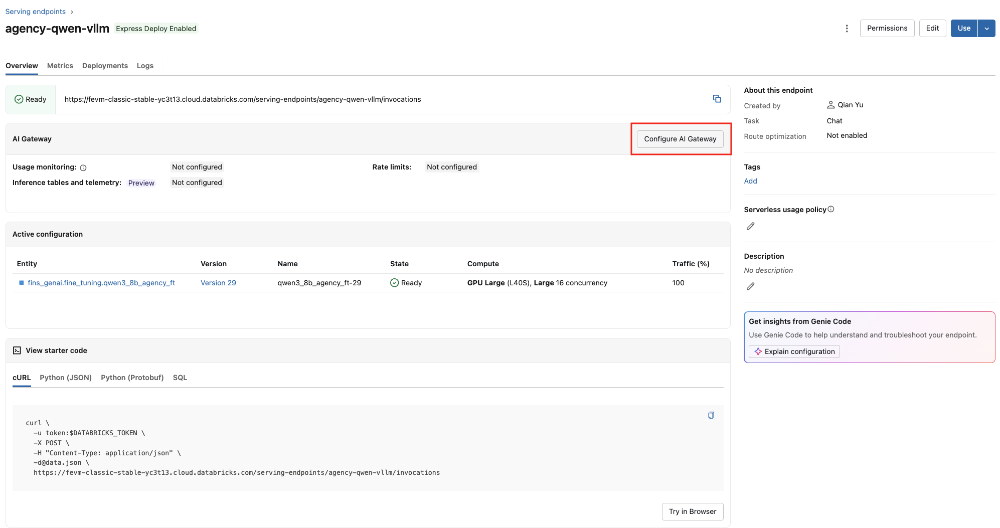
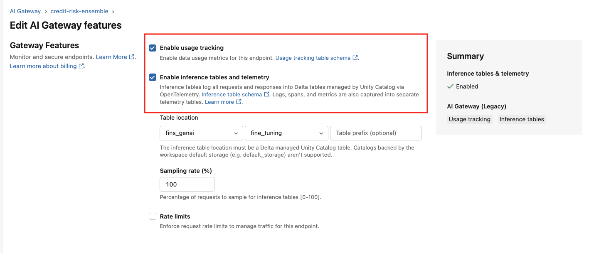

# LLM serving — load test & sizing

Load-test a **custom-LLM Databricks Model Serving endpoint** (e.g. the fine-tuned Qwen3-8B) and visualize the results from **both sides**:

- **Client side** — Locust drives concurrent traffic and reports latency percentiles, RPS, failures, and exceptions vs. concurrency.
- **Server side** — the `serve-custom-llms-metrics` notebook charts the vLLM Prometheus/OTEL metrics (queue time, GPU cache usage, TTFT histograms) that Databricks auto-scrapes into the endpoint's `<prefix>_otel_metrics` Unity Catalog table.

Run the two over the **same time window** for the full picture. Adapted from the Databricks
reference material:
- [Load-test setup guide](https://docs.databricks.com/aws/en/machine-learning/model-serving/configure-load-test)
   - The locust load testing notebook is customized for custom LLM serving endpoint by removing route optimization 
- [Serving metrics notebook](https://docs.databricks.com/aws/en/notebooks/source/machine-learning/serve-custom-llms-metrics.html)

## Files

| File | What it is |
|------|-----------|
| `fast_load_test.py` | Locust locustfile (`FastHttpUser`, service-principal OAuth token). POSTs `input.json` to the endpoint's `/invocations` route. Measures whole-request latency; for TTFT/per-token use the server-side metrics notebook. Plain python, run by the `locust` process. |
| `input.json` | The request payload every virtual user sends. Edit this to match your real traffic; **pin `max_tokens`** so runs are comparable. Defaults to a info extraction request. |
| `notebooks/locust_load_test.py` | Driver notebook: concurrency sweep → client-side latency/RPS/failure charts → endpoint sizing math → final validation run. |
| `notebooks/serve_custom_llms_metrics.py` | Server-side metrics notebook ([Reference](https://docs.databricks.com/aws/en/machine-learning/model-serving/serve-custom-llms#monitor-your-endpoint)). Reads `<prefix>_otel_metrics` and charts gauge/counter/histogram metrics across replicas. |

## Prerequisites

1. **A deployed Model Serving endpoint** for your custom LLM, in **Ready** state.
2. **Enable inference tables with open telemetry** following the steps:
   1. Go to serving endpoint UI of your deployed model, click **config AI gateway**
      
   2. Select inference table and usage tracking (optional), select desired catalog and schema from the pull-down menu, and click update
      
3. **Cluster:** single-node, `15.4 LTS ML` runtime, CPU-optimized, **≥ 32 cores**. The client
   must out-scale the endpoint; Locust does ~4000 RPS/core depending on payload.
4. **Service principal** with **Can Query** on the endpoint, and a **secret scope** holding:
   - `service_principal_client_id`
   - `service_principal_client_secret`
5. `fast_load_test.py` and `input.json` uploaded next to (one level above) the driver notebook so
   the `../` relative paths resolve. Adjust the paths in the notebook if you lay it out differently.

## How to run

1. Deploy/confirm the endpoint; disable scale-to-zero; fix min/max concurrency (e.g. 4).
2. Validate `input.json` against the endpoint's **Use / Query** window — you must get a valid
   response before load testing.
3. Attach the driver notebook to the cluster above, fill in the **Variables** cell
   (`endpoint_name`, `secret_scope`), and run top-to-bottom.
4. Read the client-side charts, pick an operating point, let the notebook compute the endpoint
   size for your target RPS, resize, and run the final validation cell.
5. Open `serve_custom_llms_metrics.py`, point its widgets at the endpoint's `_otel_metrics` table
   and enter the time window when locust_load_test drive notebook was ran, and confirm the server-side metrics match.

## Optimization workflow (with Genie Code)

The recommended process for sizing and tuning a custom LLM endpoint is iterative.  Use **Genie Code** (Databricks Assistant) to analyze load-test results, query the server-side telemetry table, and recommend configuration changes — all without leaving the notebook editor.

### Step 1 — Baseline load test

Run `locust_load_test` with a conservative concurrency sweep (e.g. `[2, 3, 4, 5, 6, 7, 8, 9, 10]`) against the endpoint in its default configuration (`workload_size="Small"`, default vLLM args).  This establishes per-replica throughput and confirms zero failures.

### Step 2 — Analyze with Genie Code

Ask Genie Code to review the locust results. It will:

1. Read the combined latency table (RPS, P50/P99/P99.9 at each concurrency level).
2. Identify whether the test is **client-limited** (not enough concurrent users to saturate
   replicas) or **server-limited** (endpoint is at capacity).
3. Cross-reference against your SLA targets (e.g. 10 QPS, P99 < 30 s).

### Step 3 — Collect server-side metrics

Run `serve_custom_llms_metrics` over the **same time window** as the load test (use absolute
mode). Genie Code can also query the `_otel_metrics` table directly to check:

| Metric | What it tells you |
|--------|-------------------|
| `vllm_num_requests_running` (gauge) | Active decode slots per replica |
| `vllm_num_requests_waiting` (gauge) | Queued requests — high values mean you need more replicas or higher `--max-num-seqs` |
| `vllm_prefix_cache_hits_total` / `vllm_prefix_cache_queries_total` (counter) | Prefix cache hit rate — confirms `--enable-prefix-caching` is effective |
| `vllm_num_preemptions_total` (counter) | KV cache evictions — non-zero means `MAX_MODEL_LEN` or `gpu-memory-utilization` is too aggressive |
| `vllm_gpu_cache_usage_perc` (gauge) | GPU KV cache occupancy — sustained >0.95 risks preemptions |
| distinct `pod_uid` count | Number of active replicas |

### Step 4 — Resize and optimize

Based on the analysis, Genie Code recommends changes in two categories:

**vLLM entrypoint tuning** (improve per-replica throughput):

| Parameter | Purpose |
|-----------|---------|
| `--max-model-len` | Reduce from default to your actual max sequence length — frees KV cache for more concurrent batching |
| `--gpu-memory-utilization` | Push to 0.95 on dedicated serving GPUs (no competing processes) |
| `--enable-prefix-caching` | Cache the shared instruction/system prompt across requests |
| `--max-num-seqs` | Cap concurrent decode sequences to what fits in KV at your context length |
| `--disable-log-requests` | Reduce I/O overhead in production |

**Endpoint scaling** (achieve target QPS):

| `workload_size` | Provisioned concurrency | Replicas (concurrency ÷ 4) |
|-----------------|------------------------|-----------------------------|
| `"Small"` | 4 | 1 |
| `"Medium"` | 8 | 2 |
| `"Large"` | 16 | 4 |

Use the formula: **replicas needed = ceil(target_QPS / per_replica_RPS)**. Add 1 replica
for headroom if you expect traffic spikes.

### Step 5 — Re-run with saturating concurrency

After redeploying, update the concurrency sweep to values that can actually saturate the
new replica count. The minimum concurrent clients needed is:

```
min_clients = target_QPS × avg_latency_seconds
```

For example, 10 QPS × 5 s/request = 50 concurrent clients. A sweep like
`[10, 20, 30, 40, 50, 60]` covers below, at, and above saturation.

### Step 6 — Validate against SLA

Run both notebooks again over the same window. Genie Code confirms:

- ✅ RPS meets target at a sustainable concurrency level
- ✅ P99 latency stays under the SLA threshold
- ✅ Zero failures / exceptions
- ✅ Server-side: minimal request queuing, zero preemptions, healthy cache hit rate

### Example: 10 QPS, P99 < 30 s (Qwen3-8B on GPU_LARGE)

| Iteration | Config | Result |
|-----------|--------|--------|
| Baseline | 1 replica, default vLLM, sweep 2–10 | 2.1 RPS max, P99 5.5 s — client-limited |
| Optimized | 4 replicas, `--max-model-len 20480`, `--gpu-memory-utilization 0.95`, `--enable-prefix-caching`, `--max-num-seqs 14`, sweep 10–60 | **10.2 RPS** at 60 clients, **P99 8.1 s** — SLA met |

Server-side validation: 4 pods active, prefix cache 99.2 % hit rate, avg 0.8 requests waiting (max 11), zero preemptions.

## LLM-specific notes

- The load test measures **whole-request latency** only since it is a infomation extract task. For the per-token view (**TTFT**, time-per-output-token) e.g. a quesition answer task, read the server-side vLLM histograms in `serve_custom_llms_metrics.py` over the same time window — vLLM emits these directly, so there's no need to measure them client-side (and `FastHttpUser` can't stream line-by-line anyway).  - The locustfile POSTs to the Databricks `/serving-endpoints/<name>/invocations` route, so `input.json` uses the chat `messages` shape the endpoint accepts there.  - LLM latency is dominated by output length — keep `max_tokens` fixed across runs.