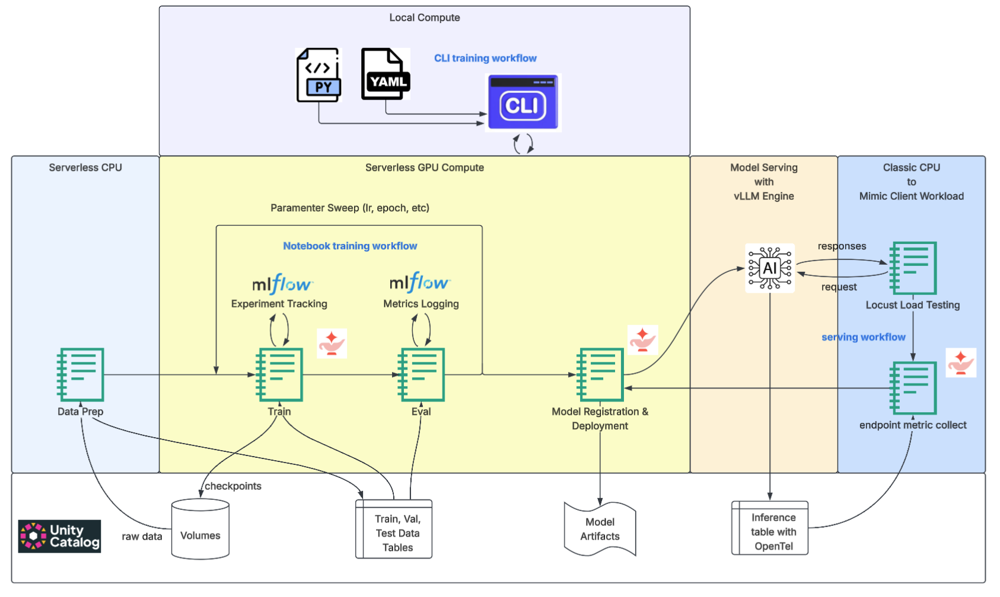

# Databricks AI Runtime — LLM fine-tuning & serving workflows

Worked examples for **full-parameter fine-tuning of an open LLM on Databricks AI Runtime** (serverless GPU) and for **serving and load-testing** the resulting model. 

* LLM: Qwen-3-8B
* Running task is information extraction

## Architecture Diagram




## Repository layout

```
.
├── LLM_finetuning_workflow/     # full-parameter fine-tuning — two interchangeable stacks
│   ├── notebooks/               #   notebook-driven pipeline (TRL SFTTrainer + DeepSpeed ZeRO-3)
│   └── cli/                     #   CLI-driven, laptop end-to-end workflow via the `air` CLI (Axolotl full-FT + FSDP)
└── LLM_serving_workflow/        # load-test & size a Model Serving endpoint for the fine-tuned model
```

Each directory has its own `README.md` with design notes and step-by-step run instructions
sections below orient you to which one to use.

## Fine-tuning workflows

Fine-tune Qwen3-8B with **full-parameter SFT** (no LoRA) on information extraction task and evaluate with holdout dataset (see [Evaluation methodology](#evaluation-methodology)):

- **[`LLM_finetuning_workflow/notebooks/`](LLM_finetuning_workflow/notebooks/README.md)** - an end-to-end notebook based workflow running in Databricks workspaces: 
  * Notebook 00 — Data Setup
  * Notebook 01 — Training (**TRL `SFTTrainer` + DeepSpeed ZeRO-3**, launched via AI Runtime on 8×H100)
  * Notebook 02 — vLLM eval, launched via AI Runtime on 1×H100
  * Notebook 03 — Training-loop job setup (composes notebooks 01 and 02)
  * Notebook 04 — Sweep launcher (runs the job over a hyperparameter grid)
  * Notebook 05 — Register & deploy the best model to a Model Serving endpoint


- **[`LLM_finetuning_workflow/cli/`](LLM_finetuning_workflow/cli/README.md)** — a config-driven workflow that runs **end-to-end from your laptop** via the `air` CLI:

  * `scripts/prep_data.py` — local raw CSV → ChatML JSONL → upload to the UC Volume (pure Python, no Spark)
  * `scripts/run_sweep.py` expands `configs/grid.yaml` and submits one `air run` per cell; training uses **Axolotl full-FT with FSDP across 8×H100**
  * `--eval` scores checkpoints with **local vLLM on AI Runtime (1×H100)**; `--pick-best` ranks by held-out F1
  * `--register` registers the winning checkpoint to the **UC Model Registry** as a vLLM ChatModel

## Serving & load testing

**[`LLM_serving_workflow/`](LLM_serving_workflow/README.md)** — load-test a custom-LLM **Model Serving endpoint**  and size it against RPS and SLA.

* Combines **client-side** Locust traffic (latency percentiles, RPS, failures vs. concurrency) with the **server-side** vLLM Prometheus/OTEL metrics
  * Use the Databricks [inference table](https://docs.databricks.com/aws/en/archive/machine-learning/inference-tables) and [Unity Catalog Open Telemetry logging](https://docs.databricks.com/aws/en/ingestion/opentelemetry/configure)
* A [Genie-Code-assisted](https://docs.databricks.com/aws/en/genie-code/use-genie-code#pane) optimization loop for vLLM entrypoint tuning and replica sizing. 

## Data & schema

This is tailored for the information extract task on insurance docs used for the workflow examples

- **Source:** tabular data where each row pairs a document's raw text with its ground-truth in JSON text
- **Schema:** a **134-field CamelCase** field set Name entities are 0-indexed with variable arity
- **Sparse targets:** the groundtruth contains **only the keys that were found** — keys are omitted when absent, not filled with `"N/A"`

## Evaluation methodology

The general method applies to all tasks for LLM fine-tuning, but the metric calculation is tailored for information extraction

### Evaluation setup

* Both fine-tuning workflows evaluate the same way. A fine-tuned checkpoint serves a **local vLLM**
server on AI runtime GPU node (no Model Serving endpoint required)
* batch inference runs over the held-out test set, and each predicted field value is scored against ground truth to produce **field-level precision / recall / F1**. 
* A field is a **match (TP)** when a fuzzy string comparison (`difflib.SequenceMatcher(gt, pred).ratio() > 0.6`) clears the threshold.

### Evaluation metrics 

#### F1 is the headline metric, and it is sparse-safe

Precision, recall, and F1 use only TP, FP, FN — **never TN**:

```
P = TP / (TP + FP)      R = TP / (TP + FN)      F1 = 2PR / (P + R)
```

**Why?**: Sparse targets create a huge number of TN cells (a field absent from *both* prediction and ground truth, but because F1 never touches TN, it is blind to them. F1 keeps its plain meaning: *of the fields that should have been / were extracted, how many are right.* Thus we peport **P/R/F1 only** for information extraction task.

> ⚠️ **We Do not report accuracy or TN-rate.** `accuracy = (TP + TN) / total` with sparse ground truth

#### Priority ("top") fields

A small **priority-field** subset based on the dataset is reported as a separate F1 alongside the aggregate: `PolicyNumber`, `OwnerFile`, `LoanFile`, and the owner/loan policy number, amount, and date. Under the sparse schema these are **business-priority fields regardless of frequency**, not an always-present core.

The subset is dominated by `PolicyNumber` the one densely populated identifier, therefore we should treat the priority-field F1 as `PolicyNumber`-weighted.

#### Per-field metrics: trust the dense fields only

Due to the sparsity of the fields, we should only trust per-field metrics of dense fields only. For the less frequent field, per-field P/R/F1 are not good metrics due to very low support count (e.g. some field only exist in < 20 samples). Overall, only the aggregated F1 and the dense fields are trustworthy at the field level

## Reference

* [AI Runtime](https://docs.databricks.com/aws/en/machine-learning/ai-runtime/)
* [AI Runtime LLM Fine-tuning Examples](https://docs.databricks.com/aws/en/machine-learning/ai-runtime/examples/gpu-llms)
* [Custom LLM Serving with vLLM Engine](https://docs.databricks.com/aws/en/machine-learning/model-serving/serve-custom-llms)
* [AI Runtime CLI](https://docs.databricks.com/aws/en/machine-learning/ai-runtime/cli/)