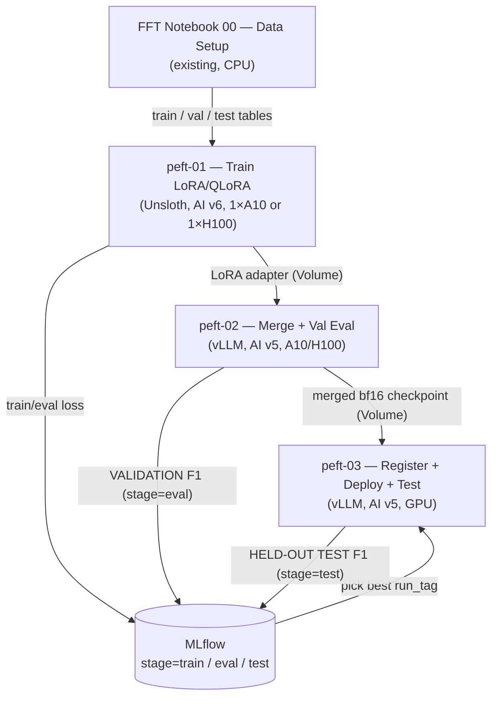

# PEFT Llama 3.1 8B Workflow Implementation Plan

> **For agentic workers:** REQUIRED SUB-SKILL: Use superpowers:subagent-driven-development (recommended) or superpowers:executing-plans to implement this plan task-by-task. Steps use checkbox (`- [ ]`) syntax for tracking.

**Goal:** Three Databricks source notebooks plus a README that LoRA/QLoRA fine-tune Llama 3.1 8B Instruct with Unsloth on the agency extraction dataset, merge the adapter into bf16 weights, evaluate on val with local vLLM, and register/deploy/test-evaluate on a vLLM Custom LLM Serving endpoint — with metrics identical to the FFT workflow.

**Architecture:** `peft-01` (AI v6 + Unsloth) trains under `@distributed(gpus=1, gpu_type=...)` and writes only a LoRA adapter to a UC Volume. `peft-02` (AI v5 + pinned vLLM stack, no Unsloth) merges the adapter into the bf16 Instruct base with `peft`, then runs a local vLLM validation eval. `peft-03` (same env as 02) registers the merged checkpoint as an MLflow `ChatModel` with a vLLM entrypoint + `env_pack`, deploys it, and scores the held-out test set with `ai_query`. Unsloth and vLLM never share an environment; only the adapter crosses the boundary.

**Tech Stack:** Databricks Serverless GPU (AI v6 / v5), `serverless_gpu.distributed`, Unsloth `2026.9.4`, TRL `SFTTrainer`, PEFT, vLLM `0.11.2`, transformers `4.57.6`, MLflow `3.12.0`, Databricks SDK `>=0.102.0`, Spark `ai_query`.

**Spec:** `docs/superpowers/specs/2026-09-27-peft-llama31-workflow-design.md` — read it alongside this plan; gotcha IDs (G1–G15) refer to its Section 9.

## Global Constraints

- All new files live in `LLM_PEFT_finetuning_workflow/notebooks/`. The two starter files in `LLM_PEFT_finetuning_workflow/` are not modified.
- Notebooks are Databricks **source** format: first line `# Databricks notebook source`, cells separated by `# COMMAND ----------`, every magic prefixed `# MAGIC ` (including `%pip`, `%md`, `%sh`, `%restart_python`) so the file is valid Python.
- Widget defaults: `catalog=fins_genai`, `schema=fine_tuning`, `volume=training_data`, `volume_model=checkpoints`, `experiment_path=/Users/q.yu@databricks.com/mlflow_experiments/agency-peft-llama31`.
- Data tables (read-only, produced by FFT notebook 00): `{catalog}.{schema}.agency_ft_dataset_{train,val,test}_v3`. Prompt file: `/Volumes/{catalog}/{schema}/{volume}/agency_prompt.txt`.
- `train_mode` ∈ {`qlora_4bit` (default), `lora_bf16`}. `RUN_TAG = f"{train_mode}_r{lora_r}_lr{learning_rate}_ep{num_epochs}"` built from the widget strings. Downstream notebooks validate it with `^(qlora_4bit|lora_bf16)_r\d+_lr.+_ep\d+$`.
- Paths: adapter `/Volumes/{catalog}/{schema}/{volume_model}/agency-peft-adapter-{RUN_TAG}`, merged `/Volumes/{catalog}/{schema}/{volume_model}/agency-peft-merged-{RUN_TAG}`.
- Notebook 01 env: `# MAGIC %pip install --quiet unsloth==2026.9.4 hf_transfer==0.1.9`. Never install vLLM there (G1). `import unsloth` precedes any `transformers`/`trl`/`peft` import (G3).
- Notebooks 02/03 env, first pass: `vllm==0.11.2 transformers==4.57.6 openai==2.17.0 mlflow==3.12.0 hf_transfer==0.1.9 "databricks-sdk>=0.102.0"`; second pass (separate cell): `--no-deps` `opencv-python-headless==4.12.0.88` (+ `peft` in 02). Assert `transformers.__version__ == "4.57.6"` after restart (G11, G12).
- Metrics identical to FFT notebook 05: extraction `StructType` copied verbatim (FFT notebook 05 lines 497–632), fuzzy `SequenceMatcher` ratio > 0.6 lowercased, **left join on ground truth** + `fillna('NA')`, mismatch → FP, metric names `all_precision/all_recall/all_f1/top8_precision/top8_recall/top8_f1`. Additions: `json_parse_failures`, `inference_errors`.
- MLflow tags: training `stage=train`; val eval `stage=eval` (`eval_split=val`) / `stage=test` (`eval_split=test`); held-out endpoint eval `stage=test`.
- UC model `{catalog}.{schema}.llama31_8b_agency_peft`; endpoint default `agency-llama-peft-vllm`; vLLM served model name `llama`; local vLLM port 3080, serving port 8080.
- No broad `try/except`; fail fast with `assert` and actionable messages. Only the narrow `json.loads` check and the FFT-copied `/health` poll / thread-pool error capture catch exceptions.
- Commits add explicit paths only (`git add <file>`). The working tree has an unrelated uncommitted FFT folder move — never stage it. Commit messages end with `Co-authored-by: Isaac <no-reply@databricks.com>`.
- **Static check** (used by every notebook task), run from the repo root:
  ```bash
  python3 -m py_compile <file> && uvx ruff check --select F821,F822,F823,E9 --builtins dbutils,spark,display <file>
  ```
  Expected: no output from `py_compile`, `All checks passed!` from ruff.

## Review Focus

1. **Double or missing BOS / wrong loss mask.** The rendered Llama 3.1 chat text already starts with `<|begin_of_text|>`; if the trainer adds another BOS, or the response boundary tokenizes differently in context, the loss lands on the wrong span. Expected: training refuses to start. Pinned by the driver preview asserts (Task 1) and the in-trainer asserts on real `input_ids`/`labels` (Task 2).
2. **Documents longer than `max_seq_length` (common at 4096 on A10).** Expected: dropped from training with counts printed and logged; val/test evals still score every document. Pinned by the `kept + dropped == total` asserts (Task 1) and the `documents scored == table row count` asserts (Tasks 4, 5).
3. **Slow or failed inference requests (A10 at long context).** Expected: request timeout configurable (default 600 s); failed docs count as FN, not dropped. Pinned by the left-join + doc-count assert (Tasks 4, 5) and the `inference_errors` metric (Task 4).
4. **Model emits non-JSON (truncated at `max_tokens`, fenced, or chatty).** Expected: scored as all-FN via `from_json` null, and surfaced as `json_parse_failures`. Pinned in Tasks 4 and 5.
5. **Merge base mismatch** — adapter trained on `...-bnb-4bit` / Unsloth-renamed `...-unsloth-bnb-4bit` repo, a 4-bit repo passed as merge base, or Volume paths. Expected: known-mirror mismatches fail before the 16 GB download; a 4-bit merge base is rejected; Volume paths print a manual-confirm warning. Pinned in Task 3.

---

### Task 1: Notebook 01 — configuration, data prep, masking preview

**Files:**
- Create: `LLM_PEFT_finetuning_workflow/notebooks/peft-01_train-lora-unsloth.py`
- Commit also: `docs/superpowers/specs/2026-09-27-peft-llama31-workflow-design.md`, `docs/superpowers/plans/2026-09-27-peft-llama31-workflow.md`

**Interfaces:**
- Consumes: FFT tables `agency_ft_dataset_{train,val}_v3` (columns `prompt`, `response`).
- Produces (module-level names used by Task 2's training function): `TRAIN_MODE`, `BASE_MODEL`, `LOAD_IN_4BIT: bool`, `GPU_TYPE: str`, `MAX_SEQ_LENGTH: int`, `PER_DEVICE_BATCH_SIZE: int`, `GRADIENT_ACCUMULATION_STEPS: int`, `LORA_R: int`, `LORA_ALPHA: int`, `LORA_DROPOUT: float`, `TARGET_MODULES: list[str]`, `LEARNING_RATE: float`, `NUM_EPOCHS: int`, `RUN_TAG: str`, `EXPERIMENT_PATH`, `TRAIN_DATASET_PATH`, `EVAL_DATASET_PATH`, `OUTPUT_DIR`, `ADAPTER_DIR`, `INSTRUCTION_PART`, `RESPONSE_PART`, `TRAIN_TOTAL`, `TRAIN_DROPPED`, `EVAL_TOTAL`, `EVAL_DROPPED`, `TRAIN_KEPT`, `EVAL_KEPT` (ints). Saved HF datasets with a single `text` column at `TRAIN_DATASET_PATH` / `EVAL_DATASET_PATH`.

- [ ] **Step 1: Create the feature branch**

```bash
cd /Users/q.yu/workspace/developments/databricks-AIRuntime-FT-workflows
git switch -c feat/peft-llama31-workflow
git status --short | head
```
Expected: branch switched; the unrelated FFT move still shows as unstaged (` D LLM_finetuning_workflow/...`, `?? LLM_FFT_finetuning_workflow/`) — leave it alone.

- [ ] **Step 2: Write the notebook file with the cells below**

Create `LLM_PEFT_finetuning_workflow/notebooks/peft-01_train-lora-unsloth.py` with exactly this content:

````python
# Databricks notebook source
# /// script
# [tool.databricks.environment]
# base_environment = "databricks_ai_v6"
# environment_version = "6"
# ///
# DBTITLE 1,Introduction
# MAGIC %md
# MAGIC # PEFT Fine-Tuning — Llama 3.1 8B Instruct + Unsloth (LoRA / QLoRA)
# MAGIC
# MAGIC Parameter-efficient fine-tuning of **Llama 3.1 8B Instruct** for title-insurance entity
# MAGIC extraction (OCR text → sparse JSON), on the **same train/val tables** as the FFT workflow
# MAGIC (`agency_ft_dataset_{train,val}_v3`, built by FFT notebook 00).
# MAGIC
# MAGIC - **Unsloth** LoRA with **response-only loss** (loss only on the assistant JSON turn)
# MAGIC - **`@distributed(gpus=1, gpu_type=...)`** from `serverless_gpu` launches training on one GPU
# MAGIC - **MLflow** tracks the run; only the **LoRA adapter** is saved (merge happens in notebook 02)
# MAGIC
# MAGIC | `train_mode` | Base | GPU | `max_seq_length` | When |
# MAGIC | --- | --- | --- | --- | --- |
# MAGIC | `qlora_4bit` (default) | `unsloth/Meta-Llama-3.1-8B-Instruct-bnb-4bit` | A10 | 4096 | cheap, fast iteration |
# MAGIC | `lora_bf16` | `unsloth/Meta-Llama-3.1-8B-Instruct` | H100 | 16384 | more precision, full-length docs |
# MAGIC
# MAGIC **Compute:** Serverless GPU with the **AI v6** environment. Do **not** install vLLM in this
# MAGIC notebook — Unsloth and vLLM pin conflicting torch/transformers (spec G1).

# COMMAND ----------

# DBTITLE 1,Install dependencies
# MAGIC %pip install --quiet unsloth==2026.9.4 hf_transfer==0.1.9
# MAGIC %restart_python

# COMMAND ----------

dbutils.widgets.dropdown("train_mode", "qlora_4bit", ["qlora_4bit", "lora_bf16"], "Train mode")
dbutils.widgets.text("catalog", "fins_genai", "Catalog")
dbutils.widgets.text("schema", "fine_tuning", "Schema")
dbutils.widgets.text("volume", "training_data", "Volume")
dbutils.widgets.text("volume_model", "checkpoints", "Volume for Model")
dbutils.widgets.text("experiment_path", "/Users/q.yu@databricks.com/mlflow_experiments/agency-peft-llama31", "MLflow Experiment Path")
# Mode-dependent settings — leave BLANK to inherit the train_mode default.
dbutils.widgets.text("base_model", "", "Base model (blank = mode default; HF id or /Volumes path)")
dbutils.widgets.text("gpu_type", "", "GPU type (blank = mode default)")
dbutils.widgets.text("max_seq_length", "", "Max sequence length (blank = mode default)")
dbutils.widgets.text("per_device_batch_size", "", "Per-device batch size (blank = mode default)")
dbutils.widgets.text("gradient_accumulation_steps", "", "Gradient accumulation (blank = mode default)")
# Shared LoRA / optimizer settings.
dbutils.widgets.text("lora_r", "16", "LoRA rank r")
dbutils.widgets.text("lora_alpha", "16", "LoRA alpha")
dbutils.widgets.text("learning_rate", "2e-4", "Learning rate")
dbutils.widgets.text("num_epochs", "3", "Number of epochs")

# COMMAND ----------

# DBTITLE 1,Configuration
import re

# train_mode sets the defaults; any non-blank widget above overrides them.
MODE_DEFAULTS = {
    "qlora_4bit": {
        "base_model": "unsloth/Meta-Llama-3.1-8B-Instruct-bnb-4bit",
        "load_in_4bit": True,
        "gpu_type": "A10",
        "max_seq_length": "4096",
        "per_device_batch_size": "2",
        "gradient_accumulation_steps": "4",
    },
    "lora_bf16": {
        "base_model": "unsloth/Meta-Llama-3.1-8B-Instruct",
        "load_in_4bit": False,
        "gpu_type": "H100",
        "max_seq_length": "16384",
        "per_device_batch_size": "1",
        "gradient_accumulation_steps": "8",
    },
}

TRAIN_MODE = dbutils.widgets.get("train_mode").strip()
assert TRAIN_MODE in MODE_DEFAULTS, f"train_mode must be one of {sorted(MODE_DEFAULTS)}, got {TRAIN_MODE!r}"


def mode_setting(name):
    """Widget value if set, else the train_mode default (blank widget = inherit)."""
    value = dbutils.widgets.get(name).strip()
    return value if value else MODE_DEFAULTS[TRAIN_MODE][name]


CATALOG = dbutils.widgets.get("catalog")
SCHEMA = dbutils.widgets.get("schema")
VOLUME = dbutils.widgets.get("volume")
VOLUME_MODEL = dbutils.widgets.get("volume_model")
EXPERIMENT_PATH = dbutils.widgets.get("experiment_path")

BASE_MODEL = mode_setting("base_model")
LOAD_IN_4BIT = MODE_DEFAULTS[TRAIN_MODE]["load_in_4bit"]
GPU_TYPE = mode_setting("gpu_type")
MAX_SEQ_LENGTH = int(mode_setting("max_seq_length"))
PER_DEVICE_BATCH_SIZE = int(mode_setting("per_device_batch_size"))
GRADIENT_ACCUMULATION_STEPS = int(mode_setting("gradient_accumulation_steps"))

LORA_R = int(dbutils.widgets.get("lora_r"))
LORA_ALPHA = int(dbutils.widgets.get("lora_alpha"))
LORA_DROPOUT = 0.0  # 0 is Unsloth's optimized path
TARGET_MODULES = ["q_proj", "k_proj", "v_proj", "o_proj", "gate_proj", "up_proj", "down_proj"]
_lr_str = dbutils.widgets.get("learning_rate").strip()
_ep_str = dbutils.widgets.get("num_epochs").strip()
LEARNING_RATE = float(_lr_str)
NUM_EPOCHS = int(_ep_str)

# Unique per config; notebooks 02/03 take this as their run_tag widget.
RUN_TAG = f"{TRAIN_MODE}_r{LORA_R}_lr{_lr_str}_ep{_ep_str}"  # e.g. qlora_4bit_r16_lr2e-4_ep3
assert re.fullmatch(r"[A-Za-z0-9_.\-]+", RUN_TAG), f"RUN_TAG has unsafe characters: {RUN_TAG!r}"

TRAIN_TABLE = f"{CATALOG}.{SCHEMA}.agency_ft_dataset_train_v3"
EVAL_TABLE = f"{CATALOG}.{SCHEMA}.agency_ft_dataset_val_v3"
# Shared storage: the remote GPU worker cannot read the driver's /tmp.
TRAIN_DATASET_PATH = f"/Volumes/{CATALOG}/{SCHEMA}/{VOLUME}/agency_peft_train_{RUN_TAG}"
EVAL_DATASET_PATH = f"/Volumes/{CATALOG}/{SCHEMA}/{VOLUME}/agency_peft_eval_{RUN_TAG}"
OUTPUT_DIR = f"/Volumes/{CATALOG}/{SCHEMA}/{VOLUME_MODEL}/agency-peft-output-{RUN_TAG}"
ADAPTER_DIR = f"/Volumes/{CATALOG}/{SCHEMA}/{VOLUME_MODEL}/agency-peft-adapter-{RUN_TAG}"

# Llama 3.1 chat-template turn headers — the response-only loss boundary.
INSTRUCTION_PART = "<|start_header_id|>user<|end_header_id|>\n\n"
RESPONSE_PART = "<|start_header_id|>assistant<|end_header_id|>\n\n"

print(f"train_mode:     {TRAIN_MODE}")
print(f"base_model:     {BASE_MODEL}  (load_in_4bit={LOAD_IN_4BIT})")
print(f"gpu_type:       {GPU_TYPE}")
print(f"max_seq_length: {MAX_SEQ_LENGTH}")
print(f"batch x accum:  {PER_DEVICE_BATCH_SIZE} x {GRADIENT_ACCUMULATION_STEPS}")
print(f"LoRA:           r={LORA_R} alpha={LORA_ALPHA} dropout={LORA_DROPOUT}")
print(f"lr / epochs:    {LEARNING_RATE} / {NUM_EPOCHS}")
print(f"RUN_TAG:        {RUN_TAG}")
print(f"adapter ->      {ADAPTER_DIR}")

# COMMAND ----------

# DBTITLE 1,Set up MLflow experiment
import mlflow

mlflow.set_experiment(EXPERIMENT_PATH)
print(f"MLflow experiment: {EXPERIMENT_PATH}")

# COMMAND ----------

# DBTITLE 1,Build chat-formatted datasets and drop over-length examples
# The instruction prompt is ALREADY in the `prompt` column (FFT notebook 00 baked
# agency_prompt.txt + OCR into it). Here we only wrap each row as a user/assistant turn and
# render it with the Llama 3.1 chat template (which also inserts its date system header).
import unsloth  # noqa: F401  — must be imported before transformers (spec G3)
from datasets import Dataset
from transformers import AutoTokenizer

tokenizer = AutoTokenizer.from_pretrained(BASE_MODEL)


def render(prompt, response):
    return tokenizer.apply_chat_template(
        [
            {"role": "user", "content": prompt.strip()},
            {"role": "assistant", "content": response.strip()},
        ],
        tokenize=False,
        add_generation_prompt=False,
    )


def build_split(table):
    """Render every row, count tokens, and DROP rows longer than MAX_SEQ_LENGTH.

    Right-truncation would cut the JSON answer and teach malformed output, so over-length
    examples are skipped instead (the val/test METRIC evals still score every document).
    """
    pdf = spark.table(table).select("prompt", "response").toPandas()
    pdf["text"] = [render(p, r) for p, r in zip(pdf["prompt"], pdf["response"])]
    # The rendered text already starts with <|begin_of_text|> -> add_special_tokens=False.
    pdf["n_tokens"] = [len(ids) for ids in tokenizer(list(pdf["text"]), add_special_tokens=False)["input_ids"]]
    kept = pdf[pdf["n_tokens"] <= MAX_SEQ_LENGTH]
    return kept, len(pdf), len(pdf) - len(kept), pdf["n_tokens"]


train_kept, TRAIN_TOTAL, TRAIN_DROPPED, train_lengths = build_split(TRAIN_TABLE)
eval_kept, EVAL_TOTAL, EVAL_DROPPED, eval_lengths = build_split(EVAL_TABLE)
TRAIN_KEPT, EVAL_KEPT = len(train_kept), len(eval_kept)

print("Train token lengths:\n", train_lengths.describe(percentiles=[0.5, 0.9, 0.99]).round(0))
print(f"Train: kept {TRAIN_KEPT}/{TRAIN_TOTAL}, dropped {TRAIN_DROPPED} over {MAX_SEQ_LENGTH} tokens "
      f"({TRAIN_DROPPED / TRAIN_TOTAL:.1%})")
print(f"Eval:  kept {EVAL_KEPT}/{EVAL_TOTAL}, dropped {EVAL_DROPPED} over {MAX_SEQ_LENGTH} tokens")

assert TRAIN_KEPT + TRAIN_DROPPED == TRAIN_TOTAL and EVAL_KEPT + EVAL_DROPPED == EVAL_TOTAL
assert TRAIN_KEPT > 0, f"Every train example exceeds max_seq_length={MAX_SEQ_LENGTH}; raise it."
assert EVAL_KEPT > 0, f"Every eval example exceeds max_seq_length={MAX_SEQ_LENGTH}; raise it."

Dataset.from_pandas(train_kept[["text"]], preserve_index=False).save_to_disk(TRAIN_DATASET_PATH)
Dataset.from_pandas(eval_kept[["text"]], preserve_index=False).save_to_disk(EVAL_DATASET_PATH)
print(f"Saved datasets -> {TRAIN_DATASET_PATH} , {EVAL_DATASET_PATH}")

# COMMAND ----------

# DBTITLE 1,Preview response-only masking (driver-side check)
# Replicates the boundary train_on_responses_only will use, on one real example, so a
# template/masking problem is caught BEFORE paying for GPU time. Notebook cell for training
# re-checks this on the trainer's actual input_ids/labels.
_ids = tokenizer(train_kept["text"].iloc[0], add_special_tokens=False)["input_ids"]
_resp_ids = tokenizer(RESPONSE_PART, add_special_tokens=False)["input_ids"]

_boundary = None
for i in range(len(_ids) - len(_resp_ids) + 1):
    if _ids[i:i + len(_resp_ids)] == _resp_ids:
        _boundary = i + len(_resp_ids)  # keep searching: the LAST assistant header wins
assert _boundary is not None, f"Response header {RESPONSE_PART!r} not found — inspect the rendered text."

_masked_text = tokenizer.decode(_ids[:_boundary])
_supervised_text = tokenizer.decode(_ids[_boundary:])
print(f"Total tokens: {len(_ids)}  |  supervised: {len(_ids) - _boundary} "
      f"({(len(_ids) - _boundary) / len(_ids):.1%})")
print("\nMASKED (not in loss), head:\n ", _masked_text[:400].replace("\n", " "), "...")
print("\nSUPERVISED (loss), head/tail:\n ", _supervised_text[:300], "...", _supervised_text[-80:])

assert _ids[0] == tokenizer.bos_token_id and _ids[1] != tokenizer.bos_token_id, "Expected exactly one BOS."
assert _supervised_text.strip().startswith("{"), "Supervised span must start with the JSON answer."
assert _supervised_text.endswith("<|eot_id|>"), "Supervised span must end with <|eot_id|> so the model learns to stop."
print("\n✓ Masking preview OK: loss falls only on the assistant JSON turn, ending in <|eot_id|>.")
````

- [ ] **Step 3: Run the static check**

Run:
```bash
python3 -m py_compile LLM_PEFT_finetuning_workflow/notebooks/peft-01_train-lora-unsloth.py && uvx ruff check --select F821,F822,F823,E9 --builtins dbutils,spark,display LLM_PEFT_finetuning_workflow/notebooks/peft-01_train-lora-unsloth.py
```
Expected: `All checks passed!`

- [ ] **Step 4: Verify every widget read has a matching widget definition**

Run:
```bash
f=LLM_PEFT_finetuning_workflow/notebooks/peft-01_train-lora-unsloth.py
comm -13 <(grep -oE 'widgets\.(text|dropdown)\("[a-z_]+' $f | sed 's/.*("//' | sort -u) \
         <(grep -oE 'widgets\.get\("[a-z_]+|mode_setting\("[a-z_]+' $f | sed 's/.*("//' | sort -u)
```
Expected: no output (every name read is defined).

- [ ] **Step 5: Commit**

```bash
git add docs/superpowers/specs/2026-09-27-peft-llama31-workflow-design.md \
        docs/superpowers/plans/2026-09-27-peft-llama31-workflow.md \
        LLM_PEFT_finetuning_workflow/notebooks/peft-01_train-lora-unsloth.py
git commit -m "Add PEFT workflow spec/plan and notebook 01 data prep

Co-authored-by: Isaac <no-reply@databricks.com>"
```

---

### Task 2: Notebook 01 — single-GPU Unsloth training and adapter output

**Files:**
- Modify: `LLM_PEFT_finetuning_workflow/notebooks/peft-01_train-lora-unsloth.py` (append cells at end)

**Interfaces:**
- Consumes: every module-level name listed in Task 1's "Produces".
- Produces: adapter at `ADAPTER_DIR` (`adapter_config.json`, `adapter_model.safetensors`, tokenizer files); MLflow run named `RUN_TAG` with tag `stage=train` and params `peft_version`, `transformers_version`, `trl_version`, `torch_version`, `unsloth_version`, `base_model`, `train_mode` (Task 3 reads `peft_version` to set its pin).

- [ ] **Step 1: Append the training cells**

Append exactly this to the end of the file:

````python

# COMMAND ----------

# DBTITLE 1,Define the single-GPU training function
from serverless_gpu import distributed


@distributed(gpus=1, gpu_type=GPU_TYPE)
def run_training():
    """Unsloth LoRA/QLoRA SFT with response-only loss; saves only the adapter."""
    import os
    os.environ["HF_HUB_ENABLE_HF_TRANSFER"] = "1"

    import unsloth  # must precede transformers/trl/peft (spec G3)
    from unsloth import FastLanguageModel
    from unsloth.chat_templates import train_on_responses_only
    import mlflow
    import peft
    import torch
    import transformers
    import trl
    from datasets import load_from_disk
    from transformers import DataCollatorForSeq2Seq
    from trl import SFTConfig, SFTTrainer

    model, tokenizer = FastLanguageModel.from_pretrained(
        model_name=BASE_MODEL,
        max_seq_length=MAX_SEQ_LENGTH,
        dtype=None,  # auto: bf16 on A10/H100
        load_in_4bit=LOAD_IN_4BIT,
    )
    # pad == eos would mask <|eot_id|> out of the labels -> the model never learns to stop.
    assert tokenizer.pad_token is not None and tokenizer.pad_token_id != tokenizer.eos_token_id, (
        f"pad_token ({tokenizer.pad_token!r}) must differ from eos_token ({tokenizer.eos_token!r})."
    )

    model = FastLanguageModel.get_peft_model(
        model,
        r=LORA_R,
        target_modules=TARGET_MODULES,
        lora_alpha=LORA_ALPHA,
        lora_dropout=LORA_DROPOUT,
        bias="none",
        use_gradient_checkpointing="unsloth",
        random_state=3407,
    )

    train_dataset = load_from_disk(TRAIN_DATASET_PATH)
    eval_dataset = load_from_disk(EVAL_DATASET_PATH)

    args = SFTConfig(
        output_dir=OUTPUT_DIR,
        run_name=RUN_TAG,
        dataset_text_field="text",
        max_length=MAX_SEQ_LENGTH,
        packing=False,
        num_train_epochs=NUM_EPOCHS,
        per_device_train_batch_size=PER_DEVICE_BATCH_SIZE,
        per_device_eval_batch_size=1,
        gradient_accumulation_steps=GRADIENT_ACCUMULATION_STEPS,
        learning_rate=LEARNING_RATE,
        warmup_ratio=0.05,
        lr_scheduler_type="linear",
        weight_decay=0.01,
        optim="adamw_8bit",
        bf16=True,
        logging_steps=10,
        eval_strategy="epoch",
        save_strategy="epoch",
        save_total_limit=2,
        load_best_model_at_end=True,  # in-run epoch selection on eval_loss
        metric_for_best_model="eval_loss",
        seed=3407,
        report_to="mlflow",
    )
    trainer = SFTTrainer(
        model=model,
        processing_class=tokenizer,
        train_dataset=train_dataset,
        eval_dataset=eval_dataset,
        data_collator=DataCollatorForSeq2Seq(tokenizer=tokenizer),
        args=args,
    )
    trainer = train_on_responses_only(
        trainer, instruction_part=INSTRUCTION_PART, response_part=RESPONSE_PART
    )

    # Re-check masking on what the trainer will ACTUALLY see (real input_ids / labels).
    example = trainer.train_dataset[0]
    ids, labels = example["input_ids"], example["labels"]
    supervised_ids = [t for t, l in zip(ids, labels) if l != -100]
    supervised_text = tokenizer.decode(supervised_ids)
    print(f"[mask check] tokens={len(ids)} supervised={len(supervised_ids)}")
    print(f"[mask check] supervised head: {supervised_text[:200]!r}")
    print(f"[mask check] supervised tail: {supervised_text[-60:]!r}")
    assert ids[0] == tokenizer.bos_token_id and ids[1] != tokenizer.bos_token_id, (
        "Double or missing BOS in trainer input_ids — the trainer re-added <|begin_of_text|>."
    )
    assert 0 < len(supervised_ids) < len(ids), "Loss mask is empty or covers the whole sequence."
    assert supervised_text.strip().startswith("{"), "Supervised span must start with the JSON answer."
    assert supervised_text.endswith("<|eot_id|>"), "Supervised span must end with <|eot_id|>."

    trainable = sum(p.numel() for p in model.parameters() if p.requires_grad)
    total = sum(p.numel() for p in model.parameters())

    mlflow.set_experiment(EXPERIMENT_PATH)
    with mlflow.start_run(run_name=RUN_TAG, log_system_metrics=True) as run:
        # Keys deliberately avoid TrainingArguments names (e.g. learning_rate) — the Trainer's
        # MLflow callback logs those, and MLflow rejects re-logging a key with a new value.
        mlflow.log_params({
            "run_tag": RUN_TAG,
            "train_mode": TRAIN_MODE,
            "training_method": "lora_unsloth",
            "base_model": BASE_MODEL,
            "load_in_4bit": LOAD_IN_4BIT,
            "gpu_type": GPU_TYPE,
            "lora_r": LORA_R,
            "lora_alpha": LORA_ALPHA,
            "lora_dropout": LORA_DROPOUT,
            "target_modules": ",".join(TARGET_MODULES),
            "trainable_params": trainable,
            "trainable_pct": round(100 * trainable / total, 4),
            "max_seq_length": MAX_SEQ_LENGTH,
            "train_samples": TRAIN_KEPT,
            "eval_samples": EVAL_KEPT,
            "dropped_overlength_train": TRAIN_DROPPED,
            "dropped_overlength_eval": EVAL_DROPPED,
            "unsloth_version": unsloth.__version__,
            "peft_version": peft.__version__,
            "transformers_version": transformers.__version__,
            "trl_version": trl.__version__,
            "torch_version": torch.__version__,
        })
        mlflow.set_tags({"stage": "train", "approach": "peft-lora"})

        train_result = trainer.train()
        eval_metrics = trainer.evaluate()

        # PEFT save_model writes ONLY the adapter (~170 MB at r=16) — small enough for the Volume.
        trainer.save_model(ADAPTER_DIR)
        tokenizer.save_pretrained(ADAPTER_DIR)

    print(f"Training complete. train_loss={train_result.metrics['train_loss']:.4f} "
          f"eval_loss={eval_metrics['eval_loss']:.4f}  (MLflow run {run.info.run_id})")
    print(f"Versions: unsloth={unsloth.__version__} peft={peft.__version__} "
          f"transformers={transformers.__version__} trl={trl.__version__} torch={torch.__version__}")


print(f"Training function defined for 1x{GPU_TYPE}. If Unsloth compilation fails on the worker, "
      "add os.environ['UNSLOTH_COMPILE_DISABLE'] = '1' at the top of run_training (spec G5).")

# COMMAND ----------

# DBTITLE 1,Train
run_training.distributed()

# COMMAND ----------

# DBTITLE 1,Verify the adapter was saved
import os

for _f in ("adapter_config.json", "adapter_model.safetensors"):
    assert os.path.isfile(os.path.join(ADAPTER_DIR, _f)), f"Missing {_f} in {ADAPTER_DIR} — did training finish?"
print(f"Adapter verified at {ADAPTER_DIR}: {sorted(os.listdir(ADAPTER_DIR))}")
print(f"\n>>> run_tag for notebooks 02/03: {RUN_TAG}")

# COMMAND ----------

# DBTITLE 1,Next steps
# MAGIC %md
# MAGIC ## Next steps
# MAGIC
# MAGIC 1. Copy the printed `run_tag` into **peft-02_merge-and-val-eval** → merges the adapter into
# MAGIC    the bf16 Instruct base and scores the **validation** split (MLflow `stage=eval`).
# MAGIC 2. Compare val runs in MLflow; take the best `run_tag` to **peft-03_register-deploy-test**.
# MAGIC 3. If val F1 falls short: try `lr` 1e-4 / 5e-4, or a larger `lora_r` (keep `alpha/r` fixed),
# MAGIC    or switch to `train_mode=lora_bf16` on H100 for full-length context.
````

- [ ] **Step 2: Run the static check**

Run:
```bash
python3 -m py_compile LLM_PEFT_finetuning_workflow/notebooks/peft-01_train-lora-unsloth.py && uvx ruff check --select F821,F822,F823,E9 --builtins dbutils,spark,display LLM_PEFT_finetuning_workflow/notebooks/peft-01_train-lora-unsloth.py
```
Expected: `All checks passed!`

- [ ] **Step 3: Check the environment-separation and import-order rules**

Run:
```bash
f=LLM_PEFT_finetuning_workflow/notebooks/peft-01_train-lora-unsloth.py
grep -n "vllm" $f | grep -iv "do \*\*not\*\* install vllm\|unsloth and vllm" ; echo "vllm-installs: $?"
awk '/def run_training/{f=1} f && /^    import (unsloth|peft|transformers|trl)/{print NR": "$0}' $f | head -5
```
Expected: `vllm-installs: 1` (no vLLM install lines); the first printed import line is `import unsloth`.

- [ ] **Step 4: Commit**

```bash
git add LLM_PEFT_finetuning_workflow/notebooks/peft-01_train-lora-unsloth.py
git commit -m "Add Unsloth single-GPU LoRA/QLoRA training to PEFT notebook 01

Co-authored-by: Isaac <no-reply@databricks.com>"
```

---

### Task 3: Notebook 02 — environment, configuration, adapter merge

**Files:**
- Create: `LLM_PEFT_finetuning_workflow/notebooks/peft-02_merge-and-val-eval.py`

**Interfaces:**
- Consumes: adapter at `/Volumes/{catalog}/{schema}/{volume_model}/agency-peft-adapter-{run_tag}` from Task 2; `peft_version` from that MLflow run (pin).
- Produces (module-level names used by Task 4): `RUN_TAG`, `TRAIN_MODE`, `CATALOG`, `SCHEMA`, `EXPERIMENT_PATH`, `MERGE_BASE_MODEL`, `MERGED_DIR`, `LOCAL_MERGED` (local dir with merged bf16 HF checkpoint), `workdir`, `EVAL_SPLIT`, `STAGE`, `EVAL_TABLE`, `OUTPUT_TABLE`, `INSTRUCTION_PROMPT`, `TOP_8_FIELDS`, `SERVED_MODEL_NAME`, `LOCAL_PORT`, `MAX_MODEL_LEN`, `MAX_NEW_TOKENS`, `MAX_NUM_SEQS`, `GPU_MEMORY_UTILIZATION`, `REQUEST_TIMEOUT`, `MAX_WORKERS`, `OCR_CHAR_CAP`. Merged checkpoint persisted at `MERGED_DIR` (used by Task 5).

- [ ] **Step 1: Write the notebook file**

Create `LLM_PEFT_finetuning_workflow/notebooks/peft-02_merge-and-val-eval.py` with exactly this content:

````python
# Databricks notebook source
# /// script
# [tool.databricks.environment]
# base_environment = "databricks_ai_v5"
# environment_version = "5"
# ///
# DBTITLE 1,Introduction
# MAGIC %md
# MAGIC # Merge LoRA Adapter + Local vLLM Validation Eval
# MAGIC
# MAGIC 1. **Merge** — load the **bf16** Llama 3.1 8B Instruct base, apply the adapter from notebook 01
# MAGIC    (`PeftModel`), `merge_and_unload()`, save the merged HF checkpoint to the Volume.
# MAGIC    Always merges into bf16 — also for `qlora_4bit` adapters — so serving is identical.
# MAGIC 2. **Validation eval** — launch a local vLLM server on the merged weights, run the
# MAGIC    **val** split, score field-level P/R/F1 exactly like the FFT workflow, log `stage=eval`.
# MAGIC
# MAGIC **Compute:** Serverless GPU, AI v5, **A10 or H100** (H100 is faster; on A10 keep
# MAGIC `max_num_seqs=2`). No Unsloth here — vLLM's pinned stack only (spec G1, G12).

# COMMAND ----------

# DBTITLE 1,Install vLLM serving stack (pass 1)
# MAGIC %pip install vllm==0.11.2 transformers==4.57.6 openai==2.17.0 mlflow==3.12.0 hf_transfer==0.1.9 "databricks-sdk>=0.102.0"

# COMMAND ----------

# DBTITLE 1,Install peft + opencv pin (pass 2, no deps)
# peft: set to the `peft_version` param logged by notebook 01's MLflow run (spec G2).
#   --no-deps so it cannot drag in transformers>=5 (spec G12).
# opencv-python-headless 4.12: >=4.13 fails the FIPS self-test and aborts vLLM (spec G11).
# MAGIC %pip install --no-deps peft==0.17.1 opencv-python-headless==4.12.0.88
# MAGIC %restart_python

# COMMAND ----------

# DBTITLE 1,Check pinned versions
import peft
import transformers
import vllm

print(f"transformers={transformers.__version__} peft={peft.__version__} vllm={vllm.__version__}")
assert transformers.__version__ == "4.57.6", (
    f"transformers was changed to {transformers.__version__}; the AI v5 vLLM stack needs 4.57.6 (spec G12). "
    "Re-run the install cells; make sure peft is installed with --no-deps."
)

# COMMAND ----------

dbutils.widgets.text("run_tag", "qlora_4bit_r16_lr2e-4_ep3", "Run tag (printed by notebook 01)")
dbutils.widgets.text("catalog", "fins_genai", "Catalog")
dbutils.widgets.text("schema", "fine_tuning", "Schema")
dbutils.widgets.text("volume", "training_data", "Volume")
dbutils.widgets.text("volume_model", "checkpoints", "Volume for Model")
dbutils.widgets.text("experiment_path", "/Users/q.yu@databricks.com/mlflow_experiments/agency-peft-llama31", "MLflow Experiment Path")
dbutils.widgets.text("merge_base_model", "unsloth/Meta-Llama-3.1-8B-Instruct", "Merge base (bf16; HF id or /Volumes path)")
dbutils.widgets.text("max_model_len", "20480", "vLLM max model len")
dbutils.widgets.text("max_new_tokens", "3500", "Max new tokens")
dbutils.widgets.text("max_num_seqs", "2", "vLLM max concurrent seqs (2 on A10, up to 14 on H100)")
dbutils.widgets.text("gpu_memory_utilization", "0.90", "vLLM GPU memory utilization")
dbutils.widgets.text("request_timeout", "600", "Per-request timeout (s)")
# val = SELECTION eval (stage=eval). test only for a deliberate one-off (stage=test).
dbutils.widgets.text("eval_split", "val", "Eval split (val|test)")

# COMMAND ----------

# DBTITLE 1,Configuration
import os
import re
import tempfile

CATALOG = dbutils.widgets.get("catalog")
SCHEMA = dbutils.widgets.get("schema")
VOLUME = dbutils.widgets.get("volume")
VOLUME_MODEL = dbutils.widgets.get("volume_model")
EXPERIMENT_PATH = dbutils.widgets.get("experiment_path")

RUN_TAG = dbutils.widgets.get("run_tag").strip()
_m = re.fullmatch(r"(qlora_4bit|lora_bf16)_r\d+_lr.+_ep\d+", RUN_TAG)
assert _m, f"run_tag {RUN_TAG!r} does not look like notebook 01's RUN_TAG (e.g. qlora_4bit_r16_lr2e-4_ep3)."
TRAIN_MODE = _m.group(1)
TABLE_SUFFIX = re.sub(r"[^0-9A-Za-z_]", "_", RUN_TAG)

ADAPTER_DIR = f"/Volumes/{CATALOG}/{SCHEMA}/{VOLUME_MODEL}/agency-peft-adapter-{RUN_TAG}"
MERGED_DIR = f"/Volumes/{CATALOG}/{SCHEMA}/{VOLUME_MODEL}/agency-peft-merged-{RUN_TAG}"
MERGE_BASE_MODEL = dbutils.widgets.get("merge_base_model").strip()

# vLLM needs the weights on local disk, not /Volumes.
workdir = tempfile.mkdtemp()
os.chdir(workdir)
LOCAL_MERGED = os.path.join(workdir, "merged")

SERVED_MODEL_NAME = "llama"
LOCAL_PORT = 3080  # Serverless GPU notebooks allow ports 3000-3999 (spec G6d)
MAX_MODEL_LEN = int(dbutils.widgets.get("max_model_len"))
MAX_NEW_TOKENS = int(dbutils.widgets.get("max_new_tokens"))
MAX_NUM_SEQS = int(dbutils.widgets.get("max_num_seqs"))
GPU_MEMORY_UTILIZATION = float(dbutils.widgets.get("gpu_memory_utilization"))
REQUEST_TIMEOUT = int(dbutils.widgets.get("request_timeout"))
MAX_WORKERS = 4
OCR_CHAR_CAP = 100000  # far-out failsafe (~25k tokens), same as FFT

EVAL_SPLIT = dbutils.widgets.get("eval_split").strip()
assert EVAL_SPLIT in {"val", "test"}, f"eval_split must be 'val' or 'test', got {EVAL_SPLIT!r}"
STAGE = "eval" if EVAL_SPLIT == "val" else "test"
EVAL_TABLE = f"{CATALOG}.{SCHEMA}.agency_ft_dataset_{EVAL_SPLIT}_v3"
OUTPUT_TABLE = f"{CATALOG}.{SCHEMA}.agency_inference_output_llama_peft_local_vllm_{EVAL_SPLIT}_{TABLE_SUFFIX}"

# Same prompt file FFT notebook 00 baked into the train/val `prompt` column.
PROMPT_FILE = f"/Volumes/{CATALOG}/{SCHEMA}/{VOLUME}/agency_prompt.txt"
with open(PROMPT_FILE) as f:
    INSTRUCTION_PROMPT = f.read().strip()

TOP_8_FIELDS = [
    "PolicyNumber", "OwnerFile", "LoanFile",
    "OwnerPolicyNumber", "OwnerPolicyAmount", "OwnerPolicyDate",
    "LoanPolicyNumber", "LoanPolicyAmount", "LoanPolicyDate",
]

print(f"run_tag={RUN_TAG} (train_mode={TRAIN_MODE})")
print(f"adapter:  {ADAPTER_DIR}\nmerged -> {MERGED_DIR}")
print(f"eval split: {EVAL_SPLIT} -> {EVAL_TABLE} (MLflow stage={STAGE})")

# COMMAND ----------

# DBTITLE 1,Check the adapter and that the merge base matches the training base
import json

for _f in ("adapter_config.json", "adapter_model.safetensors"):
    assert os.path.isfile(os.path.join(ADAPTER_DIR, _f)), f"Missing {_f} in {ADAPTER_DIR} — run notebook 01 first."

with open(os.path.join(ADAPTER_DIR, "adapter_config.json")) as f:
    ADAPTER_BASE = json.load(f).get("base_model_name_or_path", "")


def model_family(name):
    """Normalize a mirror id so a 4-bit repo and its bf16 source compare equal."""
    n = name.lower().rstrip("/")
    for suffix in ("-unsloth-bnb-4bit", "-bnb-4bit"):
        if n.endswith(suffix):
            return n[: -len(suffix)]
    return n


print(f"Adapter trained on: {ADAPTER_BASE}")
print(f"Merging into:       {MERGE_BASE_MODEL}")
assert "bnb-4bit" not in MERGE_BASE_MODEL.lower(), "merge_base_model must be the bf16 base, not a 4-bit repo."
if MERGE_BASE_MODEL.startswith("/") or ADAPTER_BASE.startswith("/"):
    print("WARNING: a base is a local/Volume path — cannot verify it matches the training base. "
          "Confirm it is the same Llama 3.1 8B Instruct weights (spec G10).")
else:
    assert model_family(ADAPTER_BASE) == model_family(MERGE_BASE_MODEL), (
        f"Adapter base {ADAPTER_BASE!r} and merge base {MERGE_BASE_MODEL!r} are different models (spec G10)."
    )

# COMMAND ----------

# DBTITLE 1,Merge the adapter into the bf16 base (skipped if already merged)
import gc
import shutil

import pyspark.sql.functions as F
import torch
from peft import PeftModel
from transformers import AutoModelForCausalLM, AutoTokenizer

os.environ["HF_HUB_ENABLE_HF_TRANSFER"] = "1"

if os.path.isfile(os.path.join(MERGED_DIR, "config.json")):
    print(f"Merged checkpoint already exists at {MERGED_DIR} — staging it to local disk.")
    shutil.copytree(MERGED_DIR, LOCAL_MERGED, dirs_exist_ok=True)
else:
    # Tokenizer from the adapter dir (carries chat template + pad token); re-saved below by
    # THIS env's transformers so vLLM reads a tokenizer written by the version it runs (G2).
    tokenizer = AutoTokenizer.from_pretrained(ADAPTER_DIR)
    base = AutoModelForCausalLM.from_pretrained(MERGE_BASE_MODEL, torch_dtype=torch.bfloat16, device_map="cuda")
    peft_model = PeftModel.from_pretrained(base, ADAPTER_DIR)  # uses `base`, ignores adapter's 4-bit base id
    peft_model.eval()

    # Sanity check on the SHORTEST val document (keeps HF generate fast on an A10).
    _sample_ocr = (
        spark.table(f"{CATALOG}.{SCHEMA}.agency_ft_dataset_val_v3")
        .orderBy(F.length("raw_ocr_content"))
        .select("raw_ocr_content")
        .limit(1)
        .collect()[0][0]
    )
    _input_ids = tokenizer.apply_chat_template(
        [{"role": "user", "content": INSTRUCTION_PROMPT + "\n" + _sample_ocr}],
        add_generation_prompt=True,
        return_tensors="pt",
    ).to("cuda")

    def greedy(m):
        with torch.no_grad():
            out = m.generate(_input_ids, max_new_tokens=256, do_sample=False, pad_token_id=tokenizer.pad_token_id)
        return tokenizer.decode(out[0, _input_ids.shape[1]:], skip_special_tokens=True)

    unmerged_out = greedy(peft_model)  # BEFORE merge_and_unload (it mutates the model)
    merged = peft_model.merge_and_unload()
    merged_out = greedy(merged)
    print("UNMERGED:", unmerged_out[:400])
    print("MERGED:  ", merged_out[:400])
    assert unmerged_out.strip().startswith("{") and merged_out.strip().startswith("{"), (
        "Adapter output is not JSON — check the adapter / training run before merging."
    )
    if unmerged_out != merged_out:
        # bf16 rounding can flip a greedy token; for qlora_4bit the bf16 base also differs from
        # the 4-bit training base. The merged-model val F1 below is the authoritative check.
        print("WARNING: merged and unmerged greedy outputs differ (expected small drift, see comment).")

    merged.save_pretrained(LOCAL_MERGED, safe_serialization=True, max_shard_size="5GB")
    tokenizer.save_pretrained(LOCAL_MERGED)
    print(f"Copying merged checkpoint -> {MERGED_DIR} (~16 GB) ...")
    shutil.copytree(LOCAL_MERGED, MERGED_DIR, dirs_exist_ok=True)

    # Free the GPU for vLLM.
    del merged, peft_model, base, _input_ids
    gc.collect()
    torch.cuda.empty_cache()

_files = os.listdir(LOCAL_MERGED)
assert "config.json" in _files and any(f.endswith(".safetensors") for f in _files), (
    f"Merged checkpoint in {LOCAL_MERGED} is incomplete: {_files}"
)
print(f"Merged checkpoint ready locally at {LOCAL_MERGED} ({len(_files)} files); persisted at {MERGED_DIR}")
````

- [ ] **Step 2: Run the static check**

Run:
```bash
python3 -m py_compile LLM_PEFT_finetuning_workflow/notebooks/peft-02_merge-and-val-eval.py && uvx ruff check --select F821,F822,F823,E9 --builtins dbutils,spark,display LLM_PEFT_finetuning_workflow/notebooks/peft-02_merge-and-val-eval.py
```
Expected: `All checks passed!`

- [ ] **Step 3: Exercise the merge-base check logic locally (Review Focus 5)**

Run:
```bash
python3 - <<'EOF'
import re
src = open("LLM_PEFT_finetuning_workflow/notebooks/peft-02_merge-and-val-eval.py").read()
ns = {}
exec(re.search(r"def model_family\(name\):.*?return n\n", src, re.S).group(0), ns)
mf = ns["model_family"]
bf16 = "unsloth/Meta-Llama-3.1-8B-Instruct"
assert mf("unsloth/Meta-Llama-3.1-8B-Instruct-bnb-4bit") == mf(bf16)
assert mf("unsloth/meta-llama-3.1-8b-instruct-unsloth-bnb-4bit") == mf(bf16)
assert mf(bf16 + "/") == mf(bf16)
assert mf("unsloth/Meta-Llama-3.1-8B") != mf(bf16)          # base vs Instruct must NOT match
assert re.fullmatch(r"(qlora_4bit|lora_bf16)_r\d+_lr.+_ep\d+", "qlora_4bit_r16_lr2e-4_ep3")
assert not re.fullmatch(r"(qlora_4bit|lora_bf16)_r\d+_lr.+_ep\d+", "lr2e-5_ep4")  # FFT tag rejected
print("merge-base + run_tag checks OK")
EOF
```
Expected: `merge-base + run_tag checks OK`

- [ ] **Step 4: Commit**

```bash
git add LLM_PEFT_finetuning_workflow/notebooks/peft-02_merge-and-val-eval.py
git commit -m "Add PEFT notebook 02 adapter merge into bf16 base

Co-authored-by: Isaac <no-reply@databricks.com>"
```

---

### Task 4: Notebook 02 — local vLLM validation eval and scoring

**Files:**
- Modify: `LLM_PEFT_finetuning_workflow/notebooks/peft-02_merge-and-val-eval.py` (append cells at end)

**Interfaces:**
- Consumes: every name in Task 3's "Produces".
- Produces: Delta table `OUTPUT_TABLE` (`File_Name`, `model_output`); MLflow run `f"{STAGE}_{RUN_TAG}"` with metrics `all_precision, all_recall, all_f1, top8_precision, top8_recall, top8_f1, json_parse_failures, inference_errors`, params `eval_split, eval_table, run_tag, train_mode, merged_dir, merge_base_model, inference=local_vllm, matching_threshold=0.6, max_model_len, max_new_tokens, documents_scored`, tags `stage`, `approach=peft-lora`.

- [ ] **Step 1: Append the vLLM + inference cells**

Append exactly this to the end of the file:

````python

# COMMAND ----------

# DBTITLE 1,Define the vLLM entrypoint
def entrypoint(port: int) -> str:
    args = [
        "python", "-u", "-m", "vllm.entrypoints.openai.api_server",
        "--model", LOCAL_MERGED,
        "--served-model-name", SERVED_MODEL_NAME,
        "--host", "0.0.0.0",
        "--port", str(port),
        "--dtype", "bfloat16",
        "--max-model-len", str(MAX_MODEL_LEN),
        "--gpu-memory-utilization", str(GPU_MEMORY_UTILIZATION),
        "--max-num-seqs", str(MAX_NUM_SEQS),
        "--enable-prefix-caching",  # the ~1.5K-token instruction prompt is shared by every request
    ]
    return " ".join(args)


print(entrypoint(LOCAL_PORT))

# COMMAND ----------

# DBTITLE 1,Start local vLLM server and wait for /health
import subprocess
import time

import requests

log_path = os.path.join(workdir, "vllm.log")
log_fh = open(log_path, "w")
proc = subprocess.Popen(
    ["bash", "-lc", entrypoint(LOCAL_PORT)],
    stdout=log_fh, stderr=subprocess.STDOUT, start_new_session=True,
)
print(f"vLLM starting (pid={proc.pid}) on port {LOCAL_PORT} — polling /health (logs -> {log_path}) ...")

STARTUP_TIMEOUT = 1500
deadline = time.time() + STARTUP_TIMEOUT
ready = False
while time.time() < deadline:
    if proc.poll() is not None:
        raise RuntimeError(f"vLLM exited during startup (code {proc.returncode}). See {log_path}.")
    try:
        if requests.get(f"http://localhost:{LOCAL_PORT}/health", timeout=2).status_code == 200:
            ready = True
            print(f"vLLM is ready after {int(time.time() - (deadline - STARTUP_TIMEOUT))}s.")
            break
    except Exception:
        pass
    time.sleep(5)
if not ready:
    with open(log_path) as f:
        print("".join(f.readlines()[-120:]))
    raise RuntimeError(
        f"vLLM did not become ready within {STARTUP_TIMEOUT}s. On an A10, a KV-cache error means: "
        "lower max_model_len (e.g. 16384) or raise gpu_memory_utilization slightly."
    )

# COMMAND ----------

# DBTITLE 1,Smoke test — single extraction request
sample_ocr = spark.table(EVAL_TABLE).select("raw_ocr_content").limit(1).collect()[0][0]
resp = requests.post(
    f"http://localhost:{LOCAL_PORT}/invocations",
    json={
        "messages": [{"role": "user", "content": INSTRUCTION_PROMPT + "\n" + sample_ocr}],
        "max_tokens": MAX_NEW_TOKENS,
        "temperature": 0.0,
    },
    timeout=REQUEST_TIMEOUT,
)
resp.raise_for_status()
print(resp.json()["choices"][0]["message"]["content"][:1500])

# COMMAND ----------

# DBTITLE 1,Batch inference over the eval split (thread-pooled local vLLM)
from concurrent.futures import ThreadPoolExecutor, as_completed

docs = (
    spark.table(EVAL_TABLE)
    .selectExpr("file_name AS File_Name", "raw_ocr_content AS Raw_OCR_Content")
    .toPandas()
    .to_dict("records")
)
print(f"Running inference on {len(docs)} {EVAL_SPLIT} documents ...")


def infer(row):
    content = INSTRUCTION_PROMPT + "\n" + row["Raw_OCR_Content"][:OCR_CHAR_CAP]
    resp = requests.post(
        f"http://localhost:{LOCAL_PORT}/invocations",
        json={"messages": [{"role": "user", "content": content}],
              "max_tokens": MAX_NEW_TOKENS, "temperature": 0.0},
        timeout=REQUEST_TIMEOUT,
    )
    resp.raise_for_status()
    return {"File_Name": row["File_Name"],
            "model_output": resp.json()["choices"][0]["message"]["content"]}


results, errors = [], []
with ThreadPoolExecutor(max_workers=MAX_WORKERS) as ex:
    futures = {ex.submit(infer, r): r["File_Name"] for r in docs}
    for i, fut in enumerate(as_completed(futures), 1):
        fname = futures[fut]
        try:
            results.append(fut.result())
        except Exception as e:
            errors.append(fname)  # scored as FN below (left join), never dropped
            print(f"  ERROR {fname}: {e}")
        if i % 25 == 0:
            print(f"  {i}/{len(docs)} done")

print(f"Inference complete: {len(results)} ok, {len(errors)} errors.")
assert results, "No predictions produced — every inference request failed. See vllm.log."

# COMMAND ----------

# DBTITLE 1,Stop the local vLLM server
import signal

os.killpg(os.getpgid(proc.pid), signal.SIGTERM)
time.sleep(2)
print("vLLM stopped.")

# COMMAND ----------

# DBTITLE 1,Persist raw outputs
import pandas as pd

spark.createDataFrame(pd.DataFrame(results)).write.mode("overwrite").option(
    "overwriteSchema", "true"
).saveAsTable(OUTPUT_TABLE)
print(f"Wrote {len(results)} outputs -> {OUTPUT_TABLE}")
display(spark.table(OUTPUT_TABLE).limit(5))
````

- [ ] **Step 2: Append the scoring + MLflow cells**

Append the following to the end of the file. The line `# <<EXTRACTION_SCHEMA>>` is replaced in Step 3 by the verbatim FFT schema.

````python

# COMMAND ----------

# DBTITLE 1,Evaluation Section
# MAGIC %md
# MAGIC ## Evaluation — field-level accuracy (identical to the FFT workflow)
# MAGIC
# MAGIC Fuzzy match (SequenceMatcher ratio > 0.6), **left join on ground truth** so a failed
# MAGIC document counts as FN, mismatch → FP. Plus `json_parse_failures` / `inference_errors`.

# COMMAND ----------

# DBTITLE 1,Parse and flatten outputs
import difflib

from pyspark.sql.functions import col, from_json
from pyspark.sql.types import StringType, StructField, StructType

# Copied verbatim from FFT agency-05_deploy-endpoint-test.py — keep in sync with agency_prompt.txt.
# <<EXTRACTION_SCHEMA>>

outputs_pdf = (
    spark.table(OUTPUT_TABLE)
    .withColumn("parsed", from_json(col("model_output"), extraction_schema))
    .select("File_Name", "parsed.*")
    .toPandas()
)
outputs_melted = pd.melt(outputs_pdf, id_vars=["File_Name"], var_name="field", value_name="prediction")

gt_pdf = (
    spark.table(EVAL_TABLE)
    .withColumn("gt", from_json(col("ground_truths"), extraction_schema))
    .selectExpr("file_name AS File_Name", "gt.*")
    .toPandas()
)
gt_melted = pd.melt(gt_pdf, id_vars=["File_Name"], var_name="field", value_name="ground_truth")


def is_json_object(s):
    try:
        return isinstance(json.loads(s), dict)
    except (TypeError, ValueError):
        return False


JSON_PARSE_FAILURES = sum(not is_json_object(r["model_output"]) for r in results)
INFERENCE_ERRORS = len(errors)
print(f"Predictions: {len(outputs_melted)} field values | Ground truth: {len(gt_melted)} field values")
print(f"json_parse_failures={JSON_PARSE_FAILURES}  inference_errors={INFERENCE_ERRORS}")

# COMMAND ----------

# DBTITLE 1,Compute field-level metrics
# LEFT join on GROUND TRUTH: a doc that errored/timed out has no prediction rows -> NaN ->
# 'NA' -> FN. (FFT notebook 05 and the CLI do the same; an inner join would inflate F1.)
merged = pd.merge(gt_melted, outputs_melted, on=["File_Name", "field"], how="left").fillna("NA")

N_DOCS = spark.table(EVAL_TABLE).count()
assert merged["File_Name"].nunique() == N_DOCS, (
    f"Scored {merged['File_Name'].nunique()} docs but {EVAL_TABLE} has {N_DOCS} — every doc must be scored."
)


def is_match(gt, pred, threshold=0.6):
    if gt == 'NA' and pred == 'NA':
        return 'TN'  # True Negative
    if gt == 'NA' and pred != 'NA':
        return 'FP'  # False Positive
    if gt != 'NA' and pred == 'NA':
        return 'FN'  # False Negative
    if difflib.SequenceMatcher(None, str(gt).lower(), str(pred).lower()).ratio() > threshold:
        return 'TP'  # True Positive
    return 'FP'  # Mismatch


def compute_prf(df):
    tp = (df["result"] == "TP").sum()
    fp = (df["result"] == "FP").sum()
    fn = (df["result"] == "FN").sum()
    precision = tp / (tp + fp) if (tp + fp) > 0 else 0
    recall = tp / (tp + fn) if (tp + fn) > 0 else 0
    f1 = 2 * precision * recall / (precision + recall) if (precision + recall) > 0 else 0
    return {"precision": float(precision), "recall": float(recall), "f1": float(f1)}


merged["result"] = merged.apply(lambda r: is_match(r["ground_truth"], r["prediction"]), axis=1)
overall = compute_prf(merged)
top8 = compute_prf(merged[merged["field"].isin(TOP_8_FIELDS)])

print(f"=== {EVAL_SPLIT.upper()} metrics — {RUN_TAG} ({N_DOCS} docs) ===")
print(f"  all:  P {overall['precision']:.4f}  R {overall['recall']:.4f}  F1 {overall['f1']:.4f}")
print(f"  top8: P {top8['precision']:.4f}  R {top8['recall']:.4f}  F1 {top8['f1']:.4f}")

# COMMAND ----------

# DBTITLE 1,Per-field accuracy breakdown
field_metrics = merged.groupby("field")["result"].apply(
    lambda x: pd.Series({
        "accuracy": ((x == "TP") | (x == "TN")).sum() / len(x),
        "tp": (x == "TP").sum(),
        "fp": (x == "FP").sum(),
        "fn": (x == "FN").sum(),
        "tn": (x == "TN").sum(),
    })
).unstack().sort_values("accuracy", ascending=False)
display(spark.createDataFrame(field_metrics.reset_index()))

# COMMAND ----------

# DBTITLE 1,Log metrics to MLflow
import mlflow

mlflow.set_experiment(EXPERIMENT_PATH)
with mlflow.start_run(run_name=f"{STAGE}_{RUN_TAG}") as run:
    mlflow.log_metrics({f"all_{k}": v for k, v in overall.items()})
    mlflow.log_metrics({f"top8_{k}": v for k, v in top8.items()})
    mlflow.log_metrics({"json_parse_failures": JSON_PARSE_FAILURES, "inference_errors": INFERENCE_ERRORS})
    mlflow.log_params({
        "eval_split": EVAL_SPLIT,
        "eval_table": EVAL_TABLE,
        "run_tag": RUN_TAG,
        "train_mode": TRAIN_MODE,
        "merged_dir": MERGED_DIR,
        "merge_base_model": MERGE_BASE_MODEL,
        "inference": "local_vllm",
        "matching_threshold": 0.6,
        "max_model_len": MAX_MODEL_LEN,
        "max_new_tokens": MAX_NEW_TOKENS,
        "documents_scored": N_DOCS,
    })
    mlflow.set_tags({"stage": STAGE, "approach": "peft-lora"})
    print(f"Logged to MLflow run {run.info.run_id} (split={EVAL_SPLIT}, stage={STAGE})")
````

- [ ] **Step 3: Insert the verbatim FFT extraction schema**

Run:
```bash
python3 - <<'EOF'
fft = "LLM_FFT_finetuning_workflow/notebooks/agency-05_deploy-endpoint-test.py"
nb = "LLM_PEFT_finetuning_workflow/notebooks/peft-02_merge-and-val-eval.py"
lines = open(fft).read().split("\n")
schema = "\n".join(lines[496:632])          # FFT notebook 05 lines 497-632
assert schema.startswith("extraction_schema = StructType([") and schema.endswith("])"), schema[:60]
src = open(nb).read()
assert src.count("# <<EXTRACTION_SCHEMA>>") == 1
open(nb, "w").write(src.replace("# <<EXTRACTION_SCHEMA>>", schema))
print("schema inserted")
EOF
```
Expected: `schema inserted`

- [ ] **Step 4: Verify metric parity with FFT**

Run:
```bash
fft=LLM_FFT_finetuning_workflow/notebooks/agency-05_deploy-endpoint-test.py
nb=LLM_PEFT_finetuning_workflow/notebooks/peft-02_merge-and-val-eval.py
diff <(grep "StructField(" $fft) <(grep "StructField(" $nb) && echo SCHEMA_OK
diff <(sed -n '/^def is_match/,/Mismatch/p' $fft) <(sed -n '/^def is_match/,/Mismatch/p' $nb) && echo MATCHER_OK
grep -c 'how="left"' $nb
```
Expected: `SCHEMA_OK`, `MATCHER_OK`, `1`.

- [ ] **Step 5: Exercise the scoring logic locally (Review Focus 3, 4)**

Run:
```bash
uv run --with pandas python - <<'EOF'
import re, json, difflib
import pandas as pd
src = open("LLM_PEFT_finetuning_workflow/notebooks/peft-02_merge-and-val-eval.py").read()
ns = {"difflib": difflib, "json": json}
for fn in ("is_match", "compute_prf", "is_json_object"):
    exec(re.search(rf"def {fn}\(.*?\n(?=\n\n|\ndef |\nmerged)", src, re.S).group(0), ns)
# gt: doc A has PolicyNumber; doc B (inference failed -> no prediction rows)
gt = pd.DataFrame({"File_Name": ["A", "B"], "field": ["PolicyNumber"] * 2, "ground_truth": ["P-1", "P-2"]})
pred = pd.DataFrame({"File_Name": ["A"], "field": ["PolicyNumber"], "prediction": ["p-1"]})
m = pd.merge(gt, pred, on=["File_Name", "field"], how="left").fillna("NA")
m["result"] = m.apply(lambda r: ns["is_match"](r["ground_truth"], r["prediction"]), axis=1)
assert list(m["result"]) == ["TP", "FN"], list(m["result"])          # failed doc counts as FN
assert abs(ns["compute_prf"](m)["recall"] - 0.5) < 1e-9
assert ns["is_match"]("123 Main St", "999 Oak Ave") == "FP"           # mismatch -> FP (FFT convention)
assert ns["is_json_object"]('{"a": 1}') and not ns["is_json_object"]('```json\n{"a": 1}\n```')
assert not ns["is_json_object"](None) and not ns["is_json_object"]('{"a": 1')  # truncated
print("scoring checks OK")
EOF
```
Expected: `scoring checks OK`

- [ ] **Step 6: Run the static check**

Run:
```bash
python3 -m py_compile LLM_PEFT_finetuning_workflow/notebooks/peft-02_merge-and-val-eval.py && uvx ruff check --select F821,F822,F823,E9 --builtins dbutils,spark,display LLM_PEFT_finetuning_workflow/notebooks/peft-02_merge-and-val-eval.py
```
Expected: `All checks passed!`

- [ ] **Step 7: Commit**

```bash
git add LLM_PEFT_finetuning_workflow/notebooks/peft-02_merge-and-val-eval.py
git commit -m "Add local vLLM validation eval to PEFT notebook 02

Co-authored-by: Isaac <no-reply@databricks.com>"
```

---

### Task 5: Notebook 03 — register, deploy, held-out test eval

**Files:**
- Create: `LLM_PEFT_finetuning_workflow/notebooks/peft-03_register-deploy-test.py`

**Interfaces:**
- Consumes: merged checkpoint at `/Volumes/{catalog}/{schema}/{volume_model}/agency-peft-merged-{run_tag}` (Task 3); the chosen `run_tag` from comparing `stage=eval` runs (Task 4).
- Produces: UC model `{catalog}.{schema}.llama31_8b_agency_peft` (version tagged `run_tag`); serving endpoint `endpoint_name`; table `{catalog}.{schema}.agency_inference_output_llama_peft_{TABLE_SUFFIX}`; MLflow run `test_{run_tag}` tagged `stage=test`, `approach=held-out-test`.

- [ ] **Step 1: Write the notebook file**

Create `LLM_PEFT_finetuning_workflow/notebooks/peft-03_register-deploy-test.py` with exactly this content:

````python
# Databricks notebook source
# /// script
# [tool.databricks.environment]
# base_environment = "databricks_ai_v5"
# environment_version = "5"
# ///
# DBTITLE 1,Introduction
# MAGIC %md
# MAGIC # Register, Deploy (vLLM Custom LLM Serving) & Held-Out Test Eval
# MAGIC
# MAGIC Serves the merged PEFT checkpoint the same way FFT notebook 05 serves the FFT model:
# MAGIC an MLflow `ChatModel` whose `metadata.entrypoint` launches vLLM, registered with
# MAGIC `env_pack`, deployed as an `llm/v1/chat` endpoint. Then `ai_query()` over the **held-out
# MAGIC test** set — scored **once**, on the `run_tag` you selected on validation — logged `stage=test`.
# MAGIC
# MAGIC **Compute:** Serverless GPU (A10 or H100), AI v5. Must be GPU: `env_pack` needs the RAM, and
# MAGIC logging from CPU packages CPU deps so the GPU endpoint fails to start (spec G6c, G13).

# COMMAND ----------

# DBTITLE 1,Install vLLM serving stack (pass 1)
# MAGIC %pip install vllm==0.11.2 transformers==4.57.6 openai==2.17.0 mlflow==3.12.0 hf_transfer==0.1.9 "databricks-sdk>=0.102.0"

# COMMAND ----------

# DBTITLE 1,Install opencv pin (pass 2, no deps)
# opencv-python-headless >=4.13 fails the FIPS self-test and aborts vLLM (spec G11).
# MAGIC %pip install --no-deps opencv-python-headless==4.12.0.88
# MAGIC %restart_python

# COMMAND ----------

# DBTITLE 1,Check pinned versions
import transformers
import vllm

print(f"transformers={transformers.__version__} vllm={vllm.__version__}")
assert transformers.__version__ == "4.57.6", (
    f"transformers is {transformers.__version__}; the AI v5 vLLM stack needs 4.57.6 (spec G12)."
)

# COMMAND ----------

dbutils.widgets.text("run_tag", "qlora_4bit_r16_lr2e-4_ep3", "Run tag (best on validation)")
dbutils.widgets.text("catalog", "fins_genai", "Catalog")
dbutils.widgets.text("schema", "fine_tuning", "Schema")
dbutils.widgets.text("volume", "training_data", "Volume")
dbutils.widgets.text("volume_model", "checkpoints", "Volume for Model")
dbutils.widgets.text("experiment_path", "/Users/q.yu@databricks.com/mlflow_experiments/agency-peft-llama31", "MLflow Experiment Path")
dbutils.widgets.text("endpoint_name", "agency-llama-peft-vllm", "Serving endpoint name")
dbutils.widgets.dropdown("workload_type", "GPU_LARGE", ["GPU_MEDIUM", "GPU_LARGE"], "Serving GPU (GPU_MEDIUM = A10)")
dbutils.widgets.text("max_model_len", "20480", "vLLM max model len")
dbutils.widgets.text("max_num_seqs", "14", "vLLM max concurrent seqs at serving (lower for GPU_MEDIUM)")
# Blank = register a NEW version. Set to an existing version to redeploy without re-registering
# (env_pack takes 20-30 min).
dbutils.widgets.text("model_version", "", "Existing UC model version (blank = register new)")

# COMMAND ----------

# DBTITLE 1,Configuration
import os
import re
import tempfile

from databricks.sdk.service.serving import ServingModelWorkloadType

CATALOG = dbutils.widgets.get("catalog")
SCHEMA = dbutils.widgets.get("schema")
VOLUME = dbutils.widgets.get("volume")
VOLUME_MODEL = dbutils.widgets.get("volume_model")
EXPERIMENT_PATH = dbutils.widgets.get("experiment_path")

RUN_TAG = dbutils.widgets.get("run_tag").strip()
assert re.fullmatch(r"(qlora_4bit|lora_bf16)_r\d+_lr.+_ep\d+", RUN_TAG), (
    f"run_tag {RUN_TAG!r} does not look like notebook 01's RUN_TAG."
)
TABLE_SUFFIX = re.sub(r"[^0-9A-Za-z_]", "_", RUN_TAG)
MERGED_DIR = f"/Volumes/{CATALOG}/{SCHEMA}/{VOLUME_MODEL}/agency-peft-merged-{RUN_TAG}"

workdir = tempfile.mkdtemp()
os.chdir(workdir)
ARTIFACTS_PATH = "llama31"  # local dir the merged weights are copied to (relative, as in FFT 05)
SERVED_MODEL_NAME = "llama"
LOCAL_PORT = 3080    # Serverless GPU notebooks allow 3000-3999 (spec G6d)
SERVING_PORT = 8080  # Custom LLM Serving requires 8080
MAX_MODEL_LEN = int(dbutils.widgets.get("max_model_len"))
MAX_NUM_SEQS = int(dbutils.widgets.get("max_num_seqs"))

UC_MODEL_NAME = f"{CATALOG}.{SCHEMA}.llama31_8b_agency_peft"
ENDPOINT_NAME = dbutils.widgets.get("endpoint_name").strip()
_wt = dbutils.widgets.get("workload_type").strip()
assert _wt in ServingModelWorkloadType.__members__, f"Unknown workload_type {_wt!r}"
WORKLOAD_TYPE = ServingModelWorkloadType[_wt]
WORKLOAD_SIZE = "Small"         # Beta: fixed replicas, no autoscaling (spec G14)
SCALE_TO_ZERO_ENABLED = False   # GPU endpoints without scale-to-zero may be deleted daily (G6c)
MODEL_VERSION_OVERRIDE = dbutils.widgets.get("model_version").strip()

# HELD-OUT TEST — scored once, on the run_tag selected on validation.
TEST_TABLE = f"{CATALOG}.{SCHEMA}.agency_ft_dataset_test_v3"
OUTPUT_TABLE = f"{CATALOG}.{SCHEMA}.agency_inference_output_llama_peft_{TABLE_SUFFIX}"

PROMPT_FILE = f"/Volumes/{CATALOG}/{SCHEMA}/{VOLUME}/agency_prompt.txt"
with open(PROMPT_FILE) as f:
    INSTRUCTION_PROMPT = f.read().strip()

TOP_8_FIELDS = [
    "PolicyNumber", "OwnerFile", "LoanFile",
    "OwnerPolicyNumber", "OwnerPolicyAmount", "OwnerPolicyDate",
    "LoanPolicyNumber", "LoanPolicyAmount", "LoanPolicyDate",
]
print(f"run_tag={RUN_TAG}\nweights: {MERGED_DIR}\nUC model: {UC_MODEL_NAME}\nendpoint: {ENDPOINT_NAME} ({_wt})")

# COMMAND ----------

# DBTITLE 1,Stage merged weights from the Volume to local disk
import shutil

assert os.path.isfile(os.path.join(MERGED_DIR, "config.json")), (
    f"No merged checkpoint at {MERGED_DIR} — run notebook 02 for run_tag={RUN_TAG} first."
)
shutil.copytree(MERGED_DIR, ARTIFACTS_PATH, dirs_exist_ok=True)
print(f"Staged {len(os.listdir(ARTIFACTS_PATH))} files in {ARTIFACTS_PATH}/")

# COMMAND ----------

# DBTITLE 1,Define the vLLM entrypoint (single source for local test and serving)
def entrypoint(port: int, gpu_memory_utilization: float = 0.95) -> str:
    args = [
        "python", "-u", "-m", "vllm.entrypoints.openai.api_server",
        "--model", ARTIFACTS_PATH,
        "--served-model-name", SERVED_MODEL_NAME,
        "--host", "0.0.0.0",
        "--port", str(port),
        "--dtype", "bfloat16",
        "--max-model-len", str(MAX_MODEL_LEN),
        "--gpu-memory-utilization", str(gpu_memory_utilization),
        "--enable-prefix-caching",
        "--max-num-seqs", str(MAX_NUM_SEQS),
        "--disable-log-requests",
    ]
    return " ".join(args)


print("serving:", entrypoint(SERVING_PORT))

# COMMAND ----------

# DBTITLE 1,Local smoke test — start vLLM, one extraction, stop (pre-deploy check, spec G15)
import signal
import subprocess
import time

import requests

log_path = os.path.join(workdir, "vllm.log")
proc = subprocess.Popen(
    ["bash", "-lc", entrypoint(LOCAL_PORT, gpu_memory_utilization=0.90)],
    stdout=open(log_path, "w"), stderr=subprocess.STDOUT, start_new_session=True,
)
STARTUP_TIMEOUT = 1500
deadline = time.time() + STARTUP_TIMEOUT
ready = False
while time.time() < deadline:
    if proc.poll() is not None:
        raise RuntimeError(f"vLLM exited during startup (code {proc.returncode}). See {log_path}.")
    try:
        if requests.get(f"http://localhost:{LOCAL_PORT}/health", timeout=2).status_code == 200:
            ready = True
            break
    except Exception:
        pass
    time.sleep(5)
if not ready:
    with open(log_path) as f:
        print("".join(f.readlines()[-120:]))
    raise RuntimeError(f"vLLM did not become ready within {STARTUP_TIMEOUT}s.")

sample_ocr = spark.table(TEST_TABLE).select("raw_ocr_content").limit(1).collect()[0][0]
resp = requests.post(
    f"http://localhost:{LOCAL_PORT}/invocations",
    json={"messages": [{"role": "user", "content": INSTRUCTION_PROMPT + "\n" + sample_ocr}],
          "max_tokens": 3500, "temperature": 0.0},
    timeout=600,
)
resp.raise_for_status()
_smoke = resp.json()["choices"][0]["message"]["content"]
print(_smoke[:1500])
os.killpg(os.getpgid(proc.pid), signal.SIGTERM)
time.sleep(2)
assert _smoke.strip().startswith("{"), "Local smoke output is not JSON — do not register this checkpoint."
print("Local smoke test passed; vLLM stopped.")

# COMMAND ----------

# DBTITLE 1,Register model to Unity Catalog (skipped if model_version is set)
import mlflow
from mlflow import MlflowClient
from mlflow.pyfunc.model import ChatCompletionResponse, ChatModel


class LLMModel(ChatModel):
    # Serving runs metadata.entrypoint (vLLM), not predict().
    def predict(self, context, messages, params):
        return ChatCompletionResponse.from_dict({"choices": []})


if MODEL_VERSION_OVERRIDE:
    DEPLOY_VERSION = MODEL_VERSION_OVERRIDE
    print(f"Skipping registration; deploying existing {UC_MODEL_NAME} v{DEPLOY_VERSION}")
else:
    mlflow.set_experiment(EXPERIMENT_PATH)
    with mlflow.start_run(run_name=f"register_{RUN_TAG}"):
        model_info = mlflow.pyfunc.log_model(
            name=SERVED_MODEL_NAME,
            python_model=LLMModel(),
            artifacts={"model_dir": ARTIFACTS_PATH},
            metadata={"task": "llm/v1/chat", "entrypoint": entrypoint(SERVING_PORT)},
        )
    model_version = mlflow.register_model(
        model_info.model_uri, UC_MODEL_NAME, env_pack="databricks_model_serving"
    )
    DEPLOY_VERSION = str(model_version.version)
    MlflowClient().set_model_version_tag(UC_MODEL_NAME, DEPLOY_VERSION, "run_tag", RUN_TAG)
    print(f"✅ Registered {UC_MODEL_NAME} v{DEPLOY_VERSION} (run_tag={RUN_TAG})")

# COMMAND ----------

# DBTITLE 1,Wait for READY, then create or update the endpoint
import datetime

from databricks.sdk import WorkspaceClient
from databricks.sdk.service.serving import EndpointCoreConfigInput, ServedEntityInput

w = WorkspaceClient()

print(f"Checking status of {UC_MODEL_NAME} v{DEPLOY_VERSION} ...")
for i in range(180):  # up to 30 minutes (env_pack of ~16 GB takes 20-30 min)
    status = w.model_versions.get(full_name=UC_MODEL_NAME, version=int(DEPLOY_VERSION)).status.value
    if status == "READY":
        print(f"Model version {DEPLOY_VERSION} is READY.")
        break
    if status != "PENDING_REGISTRATION":
        raise RuntimeError(f"Model version {DEPLOY_VERSION} entered status {status}. Re-run the registration cell.")
    if i % 6 == 0:
        print(f"  Status: {status} — waiting ({i * 10}s elapsed) ...")
    time.sleep(10)
else:
    raise TimeoutError(
        f"Model version {DEPLOY_VERSION} not READY after 30 min; env_pack may have failed. "
        "Re-run the registration cell to create a new version."
    )

served = ServedEntityInput(
    entity_name=UC_MODEL_NAME,
    entity_version=DEPLOY_VERSION,
    workload_type=WORKLOAD_TYPE,
    workload_size=WORKLOAD_SIZE,
    scale_to_zero_enabled=SCALE_TO_ZERO_ENABLED,
)
existing = next((e for e in w.serving_endpoints.list() if e.name == ENDPOINT_NAME), None)
if existing is None:
    print(f"Creating endpoint '{ENDPOINT_NAME}' with v{DEPLOY_VERSION} ...")
    w.serving_endpoints.create_and_wait(
        name=ENDPOINT_NAME,
        config=EndpointCoreConfigInput(name=ENDPOINT_NAME, served_entities=[served]),
        timeout=datetime.timedelta(minutes=40),
    )
else:
    print(f"Updating endpoint '{ENDPOINT_NAME}' to v{DEPLOY_VERSION} ...")
    w.serving_endpoints.update_config_and_wait(
        name=ENDPOINT_NAME, served_entities=[served], timeout=datetime.timedelta(minutes=40)
    )
print("✅ Endpoint ready.")

# COMMAND ----------

# DBTITLE 1,Query the endpoint (smoke test)
from databricks.sdk.service.serving import ChatMessage, ChatMessageRole

resp = w.serving_endpoints.query(
    name=ENDPOINT_NAME,
    messages=[ChatMessage(role=ChatMessageRole.USER, content=INSTRUCTION_PROMPT + "\n" + sample_ocr)],
    max_tokens=3500,
    temperature=0.0,
)
print(resp.choices[0].message.content[:1500])

# COMMAND ----------

# DBTITLE 1,Batch inference over the held-out test set with ai_query
escaped_prompt = INSTRUCTION_PROMPT.replace("'", "\\'")
spark.sql(f"""
CREATE OR REPLACE TABLE {OUTPUT_TABLE} AS
SELECT
  file_name AS File_Name,
  ai_query(
    '{ENDPOINT_NAME}',
    CONCAT('{escaped_prompt}', '\\n', LEFT(raw_ocr_content, 100000)),
    modelParameters => named_struct('max_tokens', 3500, 'temperature', 0.0)
  ) AS model_output
FROM {TEST_TABLE}
""")
print(f"Batch inference complete -> {OUTPUT_TABLE}")
display(spark.table(OUTPUT_TABLE).limit(5))

# COMMAND ----------

# DBTITLE 1,Evaluation Section
# MAGIC %md
# MAGIC ## Held-out test evaluation (identical to the FFT workflow)

# COMMAND ----------

# DBTITLE 1,Parse and flatten outputs
import difflib
import json

import pandas as pd
from pyspark.sql.functions import col, from_json
from pyspark.sql.types import StringType, StructField, StructType

# Copied verbatim from FFT agency-05_deploy-endpoint-test.py — keep in sync with agency_prompt.txt.
# <<EXTRACTION_SCHEMA>>

outputs_pdf = (
    spark.table(OUTPUT_TABLE)
    .withColumn("parsed", from_json(col("model_output"), extraction_schema))
    .select("File_Name", "parsed.*")
    .toPandas()
)
outputs_melted = pd.melt(outputs_pdf, id_vars=["File_Name"], var_name="field", value_name="prediction")

gt_pdf = (
    spark.table(TEST_TABLE)
    .withColumn("gt", from_json(col("ground_truths"), extraction_schema))
    .selectExpr("file_name AS File_Name", "gt.*")
    .toPandas()
)
gt_melted = pd.melt(gt_pdf, id_vars=["File_Name"], var_name="field", value_name="ground_truth")


def is_json_object(s):
    try:
        return isinstance(json.loads(s), dict)
    except (TypeError, ValueError):
        return False


JSON_PARSE_FAILURES = int(sum(
    not is_json_object(s) for s in spark.table(OUTPUT_TABLE).select("model_output").toPandas()["model_output"]
))
print(f"json_parse_failures={JSON_PARSE_FAILURES}")

# COMMAND ----------

# DBTITLE 1,Compute field-level metrics
# LEFT join on GROUND TRUTH so a missing/failed doc counts as FN (same as FFT notebook 05).
merged = pd.merge(gt_melted, outputs_melted, on=["File_Name", "field"], how="left").fillna("NA")

N_DOCS = spark.table(TEST_TABLE).count()
assert merged["File_Name"].nunique() == N_DOCS, (
    f"Scored {merged['File_Name'].nunique()} docs but {TEST_TABLE} has {N_DOCS} — every doc must be scored."
)


def is_match(gt, pred, threshold=0.6):
    if gt == 'NA' and pred == 'NA':
        return 'TN'  # True Negative
    if gt == 'NA' and pred != 'NA':
        return 'FP'  # False Positive
    if gt != 'NA' and pred == 'NA':
        return 'FN'  # False Negative
    if difflib.SequenceMatcher(None, str(gt).lower(), str(pred).lower()).ratio() > threshold:
        return 'TP'  # True Positive
    return 'FP'  # Mismatch


def compute_prf(df):
    tp = (df["result"] == "TP").sum()
    fp = (df["result"] == "FP").sum()
    fn = (df["result"] == "FN").sum()
    precision = tp / (tp + fp) if (tp + fp) > 0 else 0
    recall = tp / (tp + fn) if (tp + fn) > 0 else 0
    f1 = 2 * precision * recall / (precision + recall) if (precision + recall) > 0 else 0
    return {"precision": float(precision), "recall": float(recall), "f1": float(f1)}


merged["result"] = merged.apply(lambda r: is_match(r["ground_truth"], r["prediction"]), axis=1)
overall = compute_prf(merged)
top8 = compute_prf(merged[merged["field"].isin(TOP_8_FIELDS)])

print(f"=== HELD-OUT TEST — {RUN_TAG} ({N_DOCS} docs) ===")
print(f"  all:  P {overall['precision']:.4f}  R {overall['recall']:.4f}  F1 {overall['f1']:.4f}")
print(f"  top8: P {top8['precision']:.4f}  R {top8['recall']:.4f}  F1 {top8['f1']:.4f}")

# COMMAND ----------

# DBTITLE 1,Log HELD-OUT TEST metrics to MLflow (stage=test)
mlflow.set_experiment(EXPERIMENT_PATH)
with mlflow.start_run(run_name=f"test_{RUN_TAG}") as _test_run:
    mlflow.log_metrics({f"all_{k}": v for k, v in overall.items()})
    mlflow.log_metrics({f"top8_{k}": v for k, v in top8.items()})
    mlflow.log_metrics({"json_parse_failures": JSON_PARSE_FAILURES})
    mlflow.log_params({
        "eval_split": "test",
        "eval_table": TEST_TABLE,
        "run_tag": RUN_TAG,
        "uc_model_name": UC_MODEL_NAME,
        "uc_model_version": DEPLOY_VERSION,
        "inference": "serving_endpoint_ai_query",
        "matching_threshold": 0.6,
        "documents_scored": N_DOCS,
    })
    mlflow.set_tags({"approach": "held-out-test", "stage": "test"})
    print(f"Held-out TEST metrics logged (stage=test) to run {_test_run.info.run_id}")

# COMMAND ----------

# DBTITLE 1,Per-field accuracy breakdown
field_metrics = merged.groupby("field")["result"].apply(
    lambda x: pd.Series({
        "accuracy": ((x == "TP") | (x == "TN")).sum() / len(x),
        "tp": (x == "TP").sum(),
        "fp": (x == "FP").sum(),
        "fn": (x == "FN").sum(),
        "tn": (x == "TN").sum(),
    })
).unstack().sort_values("accuracy", ascending=False)
display(spark.createDataFrame(field_metrics.reset_index()))
````

- [ ] **Step 2: Insert the verbatim FFT extraction schema**

Run:
```bash
python3 - <<'EOF'
fft = "LLM_FFT_finetuning_workflow/notebooks/agency-05_deploy-endpoint-test.py"
nb = "LLM_PEFT_finetuning_workflow/notebooks/peft-03_register-deploy-test.py"
lines = open(fft).read().split("\n")
schema = "\n".join(lines[496:632])
assert schema.startswith("extraction_schema = StructType([") and schema.endswith("])"), schema[:60]
src = open(nb).read()
assert src.count("# <<EXTRACTION_SCHEMA>>") == 1
open(nb, "w").write(src.replace("# <<EXTRACTION_SCHEMA>>", schema))
print("schema inserted")
EOF
```
Expected: `schema inserted`

- [ ] **Step 3: Verify metric parity with FFT and notebook 02**

Run:
```bash
fft=LLM_FFT_finetuning_workflow/notebooks/agency-05_deploy-endpoint-test.py
nb=LLM_PEFT_finetuning_workflow/notebooks/peft-03_register-deploy-test.py
nb2=LLM_PEFT_finetuning_workflow/notebooks/peft-02_merge-and-val-eval.py
diff <(grep "StructField(" $fft) <(grep "StructField(" $nb) && echo SCHEMA_OK
diff <(sed -n '/^def is_match/,/Mismatch/p' $fft) <(sed -n '/^def is_match/,/Mismatch/p' $nb) && echo MATCHER_OK
diff <(sed -n '/^def compute_prf/,/return {/p' $nb2) <(sed -n '/^def compute_prf/,/return {/p' $nb) && echo PRF_OK
```
Expected: `SCHEMA_OK`, `MATCHER_OK`, `PRF_OK`.

- [ ] **Step 4: Run the static check**

Run:
```bash
python3 -m py_compile LLM_PEFT_finetuning_workflow/notebooks/peft-03_register-deploy-test.py && uvx ruff check --select F821,F822,F823,E9 --builtins dbutils,spark,display LLM_PEFT_finetuning_workflow/notebooks/peft-03_register-deploy-test.py
```
Expected: `All checks passed!`

- [ ] **Step 5: Commit**

```bash
git add LLM_PEFT_finetuning_workflow/notebooks/peft-03_register-deploy-test.py
git commit -m "Add PEFT notebook 03: register, deploy, held-out test eval

Co-authored-by: Isaac <no-reply@databricks.com>"
```

---

### Task 6: README

**Files:**
- Create: `LLM_PEFT_finetuning_workflow/notebooks/README.md`

**Interfaces:**
- Consumes: notebook names, widgets, paths, and metric names from Tasks 1–5.
- Produces: user-facing docs.

- [ ] **Step 1: Write the README**

Create `LLM_PEFT_finetuning_workflow/notebooks/README.md` with exactly this content:

````markdown
# Agency PEFT Fine-Tuning Pipeline — Llama 3.1 8B + Unsloth + vLLM

Parameter-efficient (LoRA / QLoRA) fine-tuning of **Llama 3.1 8B Instruct** with **Unsloth** on Databricks AI Runtime, adapter merge into bf16 weights, local vLLM validation eval, and Model Serving deployment (vLLM Custom LLM Serving).

It uses the **same dataset, splits, prompt, and metrics** as the [FFT workflow](../../LLM_FFT_finetuning_workflow/notebooks/README.md), so PEFT and FFT F1 numbers are directly comparable.

---

## Architecture Overview



> **Select on validation, report on test.** Compare `stage=eval` runs (notebook 02) to pick a `run_tag`; score the held-out test set **once** on it in notebook 03 (`stage=test`).

**Why three notebooks / two environments:** Unsloth (training) and vLLM (inference) pin conflicting torch/transformers versions. Notebook 01 runs AI v6 + Unsloth; notebooks 02/03 run AI v5 + the pinned vLLM stack. Only the small LoRA adapter crosses between them — the merge happens in the vLLM environment with plain `peft`.

---

## Compute & Volume Layout

| Resource | Purpose |
| --- | --- |
| Tables `agency_ft_dataset_{train,val,test}_v3` | Inputs, created by FFT notebook 00 (the instruction prompt is already inside the `prompt` column) |
| Volume `training_data` | `agency_prompt.txt`, per-run HF datasets `agency_peft_{train,eval}_{run_tag}` |
| Volume `checkpoints` | `agency-peft-adapter-{run_tag}` (~170 MB), `agency-peft-merged-{run_tag}` (~16 GB), trainer output |
| UC model | `fins_genai.fine_tuning.llama31_8b_agency_peft` (versions tagged `run_tag`) |
| Endpoint | `agency-llama-peft-vllm` |

---

## The `train_mode` flag (notebook 01)

| `train_mode` | Base model | `gpu_type` | `max_seq_length` | batch × accum | Use when |
| --- | --- | --- | --- | --- | --- |
| `qlora_4bit` (**default**) | `unsloth/Meta-Llama-3.1-8B-Instruct-bnb-4bit` | A10 | 4096 | 2 × 4 | Start here: cheaper, more available, fast iteration |
| `lora_bf16` | `unsloth/Meta-Llama-3.1-8B-Instruct` | H100 | 16384 | 1 × 8 | More precision; long documents without dropping |

Leave `base_model`, `gpu_type`, `max_seq_length`, `per_device_batch_size`, `gradient_accumulation_steps` **blank** to inherit the mode default; any value you type overrides it. Shared defaults: `lora_r=16`, `lora_alpha=16`, all 7 linear modules, `lr=2e-4`, `epochs=3`, `adamw_8bit`.

`run_tag = {train_mode}_r{lora_r}_lr{learning_rate}_ep{num_epochs}` (e.g. `qlora_4bit_r16_lr2e-4_ep3`) names every artifact and is the input to notebooks 02 and 03.

---

## Notebooks

### peft-01 — Train (`peft-01_train-lora-unsloth`)

- Renders each row as a Llama 3.1 chat (`user: prompt`, `assistant: JSON`) and **drops examples longer than `max_seq_length`** (truncation would cut the JSON answer). Dropped counts are printed and logged (`dropped_overlength_train/eval`). At 4096 on A10 expect a noticeable share of long documents to be skipped for training — evaluation still scores every document.
- **Response-only loss** via Unsloth `train_on_responses_only` — asserted twice (driver preview + inside the trainer): one BOS, supervised span starts with `{`, ends with `<|eot_id|>`, and `pad_token != eos_token` so the model learns to stop.
- `@distributed(gpus=1, gpu_type=GPU_TYPE)` launches training; `eval_strategy="epoch"` + `load_best_model_at_end` keeps the best epoch (by `eval_loss`) in a single run.
- Saves **only the adapter** to `agency-peft-adapter-{run_tag}`; logs library versions (`peft_version`, …) to MLflow (`stage=train`).

### peft-02 — Merge + validation eval (`peft-02_merge-and-val-eval`)

- Loads the **bf16** Instruct base (also for `qlora_4bit` adapters), applies the adapter, `merge_and_unload()`, saves `agency-peft-merged-{run_tag}`. Skips the merge if it already exists.
- Checks the merge base matches the training base, and compares merged vs. unmerged greedy output (small drift is expected and only warned).
- Local vLLM on the **val** split → field-level metrics → MLflow `stage=eval`, plus `json_parse_failures` and `inference_errors`.
- On A10 keep `max_num_seqs=2`; raise it on H100 for throughput.

### peft-03 — Register, deploy, test (`peft-03_register-deploy-test`)

- Local vLLM smoke test (the real pre-deploy check — `predict` is a stub for custom-entrypoint models).
- MLflow `ChatModel` + vLLM `metadata.entrypoint` + `env_pack="databricks_model_serving"` → UC (20–30 min to READY). Set `model_version` to redeploy an existing version without re-registering.
- Creates/updates the endpoint (`workload_type` `GPU_LARGE` default, `GPU_MEDIUM` = A10), then `ai_query` over the **test** split → MLflow `stage=test`.

---

## Metrics (identical to FFT)

`all_precision / all_recall / all_f1` over every schema field and `top8_*` over the 9 priority fields; fuzzy match `SequenceMatcher` ratio > 0.6 (lowercased); left join on ground truth so a failed document counts as FN; a wrong value counts as FP (FFT convention). Extra diagnostics: `json_parse_failures` (outputs that are not a JSON object) and `inference_errors` (notebook 02).

> FFT notebook 02 currently uses an **inner** join (failed docs dropped), while FFT notebook 05 and these PEFT notebooks use a **left** join. If FFT val runs had inference errors, their val F1 is slightly optimistic relative to PEFT val F1. Test F1 (notebook 05 vs. peft-03) is directly comparable.

---

## Running the pipeline

1. **Once:** make sure FFT notebook 00 has built the tables and `agency_prompt.txt` is in the `training_data` Volume.
2. **peft-01** on Serverless GPU, **AI v6** (default `qlora_4bit` / A10). Copy the printed `run_tag`.
3. **peft-02** on Serverless GPU, **AI v5**, with that `run_tag`. Repeat 2–3 for other configs (e.g. `learning_rate` 1e-4 / 5e-4, `train_mode=lora_bf16`).
4. Compare `stage=eval` runs in the MLflow experiment; pick the best `run_tag`.
5. **peft-03** on Serverless GPU, **AI v5**, with the winning `run_tag` → endpoint + held-out test F1.

### LoRA vs. FFT hyperparameters

- LoRA's best learning rate is typically **~10× FFT's** (2e-4 vs. ~1e-5) and fairly stable across ranks, so the default is usually close — but it is still the most sensitive knob.
- The effective update scales with `alpha / r`: when changing `lora_r`, keep `alpha / r` fixed (or you are also changing the effective LR).
- Epochs are chosen within a run (best `eval_loss` epoch is kept), so no epoch grid is needed.
- If PEFT F1 is clearly below FFT: try a small LR check (1e-4 / 2e-4 / 5e-4), then a larger `lora_r`, then `lora_bf16` for full-length context. Add an FFT-style job/sweep only if that manual loop becomes tedious.

### Optional: pre-stage base models on a Volume

If the workspace blocks `huggingface.co` egress, or to avoid re-downloading each run, snapshot the models once (any notebook with internet access):

```python
from huggingface_hub import snapshot_download

for repo in ["unsloth/Meta-Llama-3.1-8B-Instruct", "unsloth/Meta-Llama-3.1-8B-Instruct-bnb-4bit"]:
    snapshot_download(repo, local_dir=f"/Volumes/fins_genai/fine_tuning/checkpoints/base_models/{repo.split('/')[1]}")
```

Then set `base_model` (peft-01) and `merge_base_model` (peft-02) to those `/Volumes/...` paths. With Volume paths, notebook 02 cannot auto-verify the merge base matches the training base — make sure they are the same model.

---

## Troubleshooting

| Symptom | Cause | Fix |
| --- | --- | --- |
| CUDA/ABI import errors after installs | Unsloth and vLLM installed in one env | Keep 01 (Unsloth, AI v6) and 02/03 (vLLM, AI v5) separate; never `%pip install vllm` in 01 |
| `transformers was changed to 5.x` assert in 02/03 | A package pulled a newer transformers | Install `peft` with `--no-deps`; don't upgrade AI v5 pins (segfault risk) |
| `peft` fails to load `adapter_config.json` in 02 | peft version in 02 older than in 01 | Set the 02 `peft==` pin to notebook 01's logged `peft_version` |
| vLLM aborts at startup with an OpenSSL/FIPS error | `opencv-python-headless>=4.13` | Keep the second-pass pin `opencv-python-headless==4.12.0.88` |
| Unsloth compile error on the training worker | torch.compile inside `@distributed` | Add `os.environ["UNSLOTH_COMPILE_DISABLE"] = "1"` at the top of `run_training` |
| Training waits for a GPU for a long time | H100 capacity | Use the A10 default (`qlora_4bit`), or retry later |
| OOM on A10 during training | `max_seq_length` too high for 24 GB | Keep 4096, or `per_device_batch_size=1` for 6–8K |
| vLLM KV-cache / memory error on A10 in 02/03 | 20K context on 24 GB | `max_num_seqs=2`; lower `max_model_len` to 16384 |
| Many `inference_errors` (timeouts) in 02 | Long docs on A10 | Raise `request_timeout`; or run 02 on H100 |
| High `json_parse_failures` | Output truncated at `max_new_tokens`, or model not stopping | Check the masking asserts passed; check `dropped_overlength_train` (A10) — consider `lora_bf16` |
| Masking assert fails before training | Template / BOS / tokenizer mismatch | Do not train; inspect the printed masked/supervised spans |
| Model download fails (401/403 or network) | Gated repo or blocked egress | Use the `unsloth/*` mirrors (no token), or pre-stage on a Volume (above); tokens only via `dbutils.secrets` |
| `TimeoutError` waiting for READY | `env_pack` failed silently | Re-run the registration cell (new version) |
| OOM (exit 137) during registration | `env_pack` on CPU compute | Run notebook 03 on Serverless GPU |
| Endpoint disappeared overnight | GPU endpoints without scale-to-zero are cleaned up | Re-run notebook 03 with `model_version` set (no re-registration) |

---

## Resources

* [Fine-tune Llama with Unsloth (Serverless GPU)](https://docs.databricks.com/aws/en/machine-learning/ai-runtime/examples/tutorials/sgc-finetune-llama-unsloth)
* [Distributed Unsloth fine-tuning](https://docs.databricks.com/aws/en/machine-learning/ai-runtime/examples/tutorials/sgc-finetune-llama-unsloth-distributed)
* [Serve custom LLMs (vLLM)](https://docs.databricks.com/aws/en/machine-learning/model-serving/serve-custom-llms)
* [Unsloth docs](https://docs.unsloth.ai/) · [PEFT](https://huggingface.co/docs/peft) · [vLLM](https://docs.vllm.ai/)
````

- [ ] **Step 2: Check README references match the notebooks**

Run:
```bash
cd LLM_PEFT_finetuning_workflow/notebooks
for n in peft-01_train-lora-unsloth peft-02_merge-and-val-eval peft-03_register-deploy-test; do test -f $n.py && echo "ok $n"; done
for w in train_mode base_model gpu_type max_seq_length run_tag merge_base_model max_num_seqs request_timeout workload_type model_version; do grep -q "\"$w\"" peft-0*.py && echo "widget ok $w"; done
cd -
```
Expected: three `ok` lines and ten `widget ok` lines.

- [ ] **Step 3: Commit**

```bash
git add LLM_PEFT_finetuning_workflow/notebooks/README.md
git commit -m "Add PEFT workflow README

Co-authored-by: Isaac <no-reply@databricks.com>"
```

---

### Task 7: End-to-end workspace verification (needs user: profile choice, re-auth, GPU spend)

This task runs real GPU compute and creates a serving endpoint. **Ask the user before each of Steps 3, 6, 7, 8** (spend / outward-facing). Record outcomes faithfully; if a step fails, stop and report the output instead of iterating.

**Files:**
- Modify (only if Step 5 requires): `LLM_PEFT_finetuning_workflow/notebooks/peft-02_merge-and-val-eval.py` (peft pin)

**Interfaces:**
- Consumes: all notebooks from Tasks 1–6.
- Produces: verified MLflow runs (`stage=train/eval/test`), UC model version, endpoint.

- [ ] **Step 1: Choose a profile and re-authenticate**

Ask the user which profile to use (never auto-select). Then have them run:
```bash
databricks auth login --profile <PROFILE>
databricks current-user me --profile <PROFILE>
```
Expected: their user JSON. (DEFAULT's token was expired at session start.)

- [ ] **Step 2: Check the inputs exist**

```bash
for s in train val test; do databricks tables get fins_genai.fine_tuning.agency_ft_dataset_${s}_v3 --profile <PROFILE> | head -3; done
databricks fs ls dbfs:/Volumes/fins_genai/fine_tuning/training_data/agency_prompt.txt --profile <PROFILE>
```
Expected: three table descriptions and the prompt file listed. If missing, the user must run FFT notebook 00 first.

- [ ] **Step 3: Upload the notebooks (confirm with the user first)**

```bash
databricks workspace import-dir LLM_PEFT_finetuning_workflow/notebooks \
  /Workspace/Users/q.yu@databricks.com/LLM_PEFT_finetuning_workflow/notebooks --overwrite --profile <PROFILE>
```
Expected: three notebooks imported (`peft-01…`, `peft-02…`, `peft-03…`).

- [ ] **Step 4: User runs peft-01 smoke (A10, `qlora_4bit`, `num_epochs=1`)**

In the workspace: attach Serverless GPU, **AI v6** (verify the environment panel shows AI v6; select it manually if the header did not apply), set `num_epochs=1`, Run all. Expected:
- Configuration prints `gpu_type: A10`, `max_seq_length: 4096`, `RUN_TAG: qlora_4bit_r16_lr2e-4_ep1`.
- Data cell prints kept/dropped counts; masking preview prints `✓ Masking preview OK`.
- Worker log prints the `[mask check]` lines and no assertion error; training completes with `train_loss`/`eval_loss`.
- Adapter verified; MLflow run `qlora_4bit_r16_lr2e-4_ep1` with `stage=train`.

- [ ] **Step 5: Align the peft pin**

Read the run's `peft_version` param (MLflow UI or `mlflow.get_run(<run_id>).data.params["peft_version"]`). If it differs from `0.17.1`, edit the pass-2 install line in `peft-02_merge-and-val-eval.py` to `peft==<that version>`, re-run the Task 3 static check, re-upload (Step 3 command), and commit:
```bash
git add LLM_PEFT_finetuning_workflow/notebooks/peft-02_merge-and-val-eval.py
git commit -m "Pin peft in notebook 02 to the version used for training

Co-authored-by: Isaac <no-reply@databricks.com>"
```

- [ ] **Step 6: User runs peft-02 (A10, AI v5) with `run_tag=qlora_4bit_r16_lr2e-4_ep1`**

Expected: version check passes (`transformers=4.57.6`); base-consistency check passes; merged/unmerged outputs both start with `{`; vLLM ready; `Inference complete: N ok, 0 errors` (a few errors are acceptable but must appear in `inference_errors`); metrics printed; MLflow run `eval_qlora_4bit_r16_lr2e-4_ep1` with `stage=eval` and `documents_scored` equal to the val table count.

- [ ] **Step 7: User runs peft-03 (GPU, AI v5) — creates a billable endpoint; confirm first**

Expected: local smoke passes; model version reaches READY; endpoint ready; `ai_query` table written; test metrics printed; MLflow run `test_qlora_4bit_r16_lr2e-4_ep1` with `stage=test`. Remind the user to delete the endpoint when done if it is not needed (`databricks serving-endpoints delete agency-llama-peft-vllm --profile <PROFILE>` — only on their explicit request).

- [ ] **Step 8: Precision path — peft-01 with `train_mode=lora_bf16` (H100), then peft-02 on its run_tag (confirm GPU spend first)**

Expected: Configuration shows `H100` / `16384`; `dropped_overlength_train` ≈ 0; peft-02 asserts the merged and unmerged outputs start with `{` and logs `stage=eval`.

- [ ] **Step 9: Report**

Summarize for the user: val/test F1 per run next to FFT's numbers, `dropped_overlength_*`, `json_parse_failures`, any deviations from expected output. Then use superpowers:finishing-a-development-branch.
